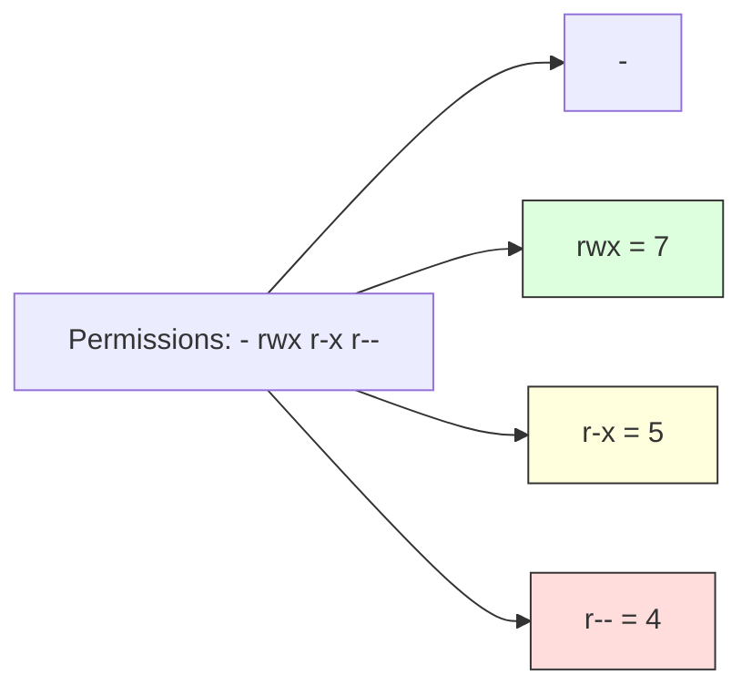

Version: 1.0.0
Last Updated: 2026-03-09
Prerequisites: Linux Fundamentals

## 1. Users and Groups

### Story Introduction

Imagine a **Large Office Building**.

*   **Users**: These are the individual employees. Each person has a unique ID card.
*   **Groups**: These are departments (e.g., Finance, Engineering, HR). 

Instead of saying "Alice is allowed to read the payroll file, Bob is allowed to read the payroll file, and Carol is allowed to read it," the manager simply creates a Group called "Finance" and says, "Everyone in the Finance group can read this file." 

When Alice joins the Finance department, she is added to the group and automatically gets all the permissions she needs. When she leaves, her ID is removed from the group, and she loses access instantly.

### Concept Explanation

Linux is a multi-user system. To manage security, every process and every file is "owned" by a User and a Group.

#### Key Entities:
*   **The Root User (UID 0)**: The all-powerful superuser who can do anything and access any file.
*   **System Users**: Accounts used by services (like `nginx`, `mysql`) to run processes securely without full root access.
*   **Regular Users**: Accounts for human beings.
*   **Primary Group**: Every user belongs to exactly one primary group (usually a group with the same name as the username).
*   **Secondary Groups**: A user can belong to multiple additional groups to gain access to shared resources.

### Code Example

```bash
# View information about yourself
id
# Output: uid=1000(abhishek) gid=1000(abhishek) groups=1000(abhishek),27(sudo),4(adm)...

# Create a new user
sudo useradd -m designer

# Create a new group
sudo groupadd marketing

# Add the user to the group
sudo usermod -aG marketing designer
```

### Explanation

*   **`id`**: Shows your User ID (UID), Group ID (GID), and all the groups you belong to.
*   **`useradd -m`**: Creates a new user and a home directory (`-m`) for them.
*   **`usermod -aG`**: Appends (`-a`) the user to a new Group (`-G`). This is the most common way to give a user new permissions.
*   **`/etc/passwd`**: The file where all user information is stored.
*   **`/etc/group`**: The file where all group definitions are stored.

### Exercises

1.  **Beginner**: Run `id` on your system. What is your UID? What groups do you belong to?
2.  **Intermediate**: Create a user called `developer` and a group called `engineering`. Add the user to the group and verify the change with the `id` command.
3.  **Advanced**: Why do we run web servers like Nginx as a non-root system user (e.g., `www-data`)? What security risk are we mitigating?

## 2. Standard File Permissions (rwx)

### Story Introduction

Think of a **Locked Cabinet** in a public space.

There are three ways you might interact with it:
1.  **Read (r)**: You can look through the glass door to see what's inside.
2.  **Write (w)**: You have the key to open the door and add or remove items.
3.  **Execute (x)**: If the item inside is a machine (like a coffee maker), you're allowed to press the 'Start' button.

Crucially, the cabinet has three sets of rules:
*   **Owner Rules**: For the person who owns the cabinet.
*   **Group Rules**: For the department that the cabinet belongs to.
*   **Other Rules**: For anyone else walking by the cabinet.

### Concept Explanation

Every file and directory in Linux has a set of permissions that govern who can do what. These are represented by the letters `r`, `w`, and `x`, often shown in three triplets.

#### The Triplets:
1.  **User (u)**: The owner of the file.
2.  **Group (g)**: Users who belong to the file's group.
3.  **Others (o)**: Everyone else.

#### Bitwise Representation:
Permissions are often expressed in numbers (Octal):
*   **Read (4)**: Binary `100`
*   **Write (2)**: Binary `010`
*   **Execute (1)**: Binary `001`

To combine permissions, you add the numbers:
*   `7` (4+2+1) = `rwx` (Full access)
*   `6` (4+2) = `rw-` (Read and Write)
*   `5` (4+1) = `r-x` (Read and Execute)
*   `4` = `r--` (Read only)

### Code Example

```bash
# View permissions
ls -l example.txt
# Output: -rw-r--r-- 1 abhishek abhishek 12 Mar 9 10:00 example.txt

# Change permissions using symbolic mode
chmod u+x example.txt  # Add execute permission for the owner
chmod g-w example.txt  # Remove write permission for the group

# Change permissions using octal mode
chmod 755 script.sh    # rwxr-xr-x (Owner=rwx, Group=rx, Others=rx)
chmod 600 private.key  # rw------- (Owner=rw, others=none)
```

### Diagram



### Real World Usage

In **Cloud Security (AWS S3, EC2)**, permissions are the first line of defense. A common mistake is setting a file to `777` (Full access for everyone) because "it fixes the error." This is a massive security hole. Production environments use the **Principle of Least Privilege**, giving only the minimum permissions required for a service to function (e.g., `600` for a database password file).

### Exercises

1.  **Beginner**: What does the permission code `644` translate to in letters (rwx format)?
2.  **Intermediate**: You have a script which you want anyone in your group to be able to run, but only you should be able to edit. What `chmod` command would you use?
3.  **Advanced**: In a directory, what does 'Execute' (x) permission allow you to do compared to 'Read' (r) permission? (Hint: try listing the contents vs. entering the directory).

## 3. Special Permissions (SUID, SGID, Sticky Bit)

### Concept Explanation

Standard permissions are sometimes not enough. Linux provides **Special Permissions** for specific scenarios.

1.  **SUID (Set User ID)**: When a file with SUID is executed, the process runs with the privileges of the **file owner**, not the person who ran it.
    *   *Visual*: A `s` instead of `x` in the owner triad (e.g., `-rwsr-xr-x`).
2.  **SGID (Set Group ID)**: Similar to SUID, but the process runs with the **group's privileges**. On a directory, it ensures that any new files created inside inherit the directory's group.
    *   *Visual*: A `s` instead of `x` in the group triad (e.g., `drwxrwsr-x`).
3.  **Sticky Bit**: On a directory, this ensures that only the file owner can delete or rename files inside that directory.
    *   *Visual*: A `t` instead of `x` in the others triad (e.g., `drwxrwxrwt`).

### Code Example

```bash
# Set SUID (adds an 's' to owner)
sudo chmod u+s /usr/bin/passwd

# Set SGID on a directory (adds an 's' to group)
chmod g+s /shared/marketing

# Set Sticky Bit (adds a 't' to others)
chmod +t /tmp
```

### Explanation

*   **`passwd` command**: This is a classic example of SUID. Regular users need to change their passwords, which are stored in `/etc/shadow` (accessible only by root). The `passwd` binary has SUID, so when you run it, it temporarily becomes "root" just to update your password.
*   **Shared Folders**: SGID is vital for dev teams. If everyone in the 'dev' group works in one folder, SGID ensures that when Alice creates a file, its group is set to 'dev' (not Alice's private group), so Bob can still edit it.
*   **`/tmp`**: The Sticky Bit prevents a malicious user from deleting other people's temporary files in the shared `/tmp` folder.

### Real World Usage

In **Container Security**, we often look for "Setuid binaries" because they are prime targets for privilege escalation. A hacker who finds a way to exploit a SUID binary can suddenly get root access to your entire system. This is why a core DevSecOps practice is to find and remove unnecessary SUID bits.

### Exercises

1.  **Beginner**: Which special permission bit is used on the `/tmp` directory to protect files?
2.  **Intermediate**: You have a shared folder `/project`. You want every file created in it to belong to the `dev` group automatically. Which command do you run?
3.  **Advanced**: Why is SUID on a script (like a Python or Bash script) usually ignored by the Linux kernel for security reasons?

## 4. Access Control Lists (ACLs)

### Concept Explanation

Standard Linux permissions follow the **UGO** model (User, Group, Other). But what if you need to give a *specific* fourth person (Dave) access to a file which is owned by Alice and shared with the 'Finance' group?

**Access Control Lists (ACLs)** allow you to define more granular permissions for specific users and groups without changing the file's ownership.

### Step-by-Step Walkthroughs

#### 1. Managing Access with ACLs (`setfacl`)
*   **`setfacl`**: "Set File Access Control List".
*   **`-m`**: Modify the existing ACL.
*   **`u:dave:rw-`**: The specific rule. `u` for user, `dave` for the name, and `rw-` for the permissions.
*   **`+` sign in `ls -l`**: Once an ACL is added, you will see a `+` after the standard permissions (e.g., `-rw-rwxr--+`).

#### 2. Changing Ownership (`chown`)
*   **`sudo chown designer:marketing secret.txt`**:
    *   **`designer`**: The new User owner.
    *   **`marketing`**: The new Group owner.
    *   **`sudo`**: Required because only root can give away file ownership in Linux.

### Best Practices

1.  **Principle of Least Privilege**: Never give `777` permissions. If a service needs to write, give it `w`, but don't give "Others" anything.
2.  **Use Groups for Teams**: Avoid giving permissions to individual users. It's much easier to manage a "Dev" group than 50 individual "User" ACLs.
3.  **Recursive changes with caution**: `chmod -R 777 /var/www` is a common disaster. Be very careful with the `-R` (Recursive) flag, especially as root.
4.  **Audit SUID/SGID**: Periodically scan your system for files with the `s` bit. These are potential security backdoors.

### Common Mistakes

*   **Octal confusion**: Mixing up `755` (Good for scripts) with `777` (Dangerous) or `644` (Good for text files).
*   **The "It worked on my machine" permissions**: Fixing a local permission error by changing everything to `777`, then forgetting that production has much stricter security.
*   **Forgetting the Execute bit on Directories**: If a directory doesn't have the `x` bit, you cannot `cd` into it, even if you have the `r` (Read) bit to list the files!
*   **ACL Blindness**: Forgetting that a file has hidden ACLs (the `+` sign) and wondering why a user still has access after you changed the standard `chmod` settings.

### Exercises

1.  **Beginner**: Which command is used to view the ACLs of a file?
2.  **Intermediate**: Give the group `auditors` read-only access to `/var/log/syslog` using ACLs.
3.  **Advanced**: How can you tell a file has an ACL just by looking at the output of `ls -l`? (Hint: Look for a `+` sign).

## Mini Projects

## Mini Projects

### Beginner: Create a secure shared folder

**Problem**: You have two users, `marketing_1` and `marketing_2`, who need to share a folder `/shared/marketing`. No one else should be able to see their files.
**Task**: Create the users and a group called `marketing`. Create the directory. Set the group ownership to `marketing`. Use standard permissions (`770`) and SGID so that new files stay in the group.
**Deliverable**: A session log showing `marketing_1` creating a file and `marketing_2` being able to edit it, while a third user `guest` is denied access.

### Intermediate: Implement "Least Privilege" for a web app

**Problem**: You are running a web application that only needs to read its config file, write to its log file, and have no other systemic access.
**Task**: Create a system user `webapp`. Set the config file to `640` (owned by `root`, group `webapp`). Set the log directory to be owned by `webapp` with `700` permissions.
**Deliverable**: A report showing that the `webapp` user can successfully read the config and write to the log, but cannot read `/etc/shadow` or write to `/bin`.

### Advanced: Design a multi-user environment for an AI training cluster

**Problem**: A university cluster has 50 researchers. Each researcher needs their own private space, but also access to a massive 10TB shared dataset (`/data/ml_models`) which should be read-only for them.
**Task**: Design the group structure. Use ACLs to give specific PIs (Principal Investigators) write access to the dataset while researchers only have read access. Implement a "drop-box" folder where researchers can submit results that only the PIs can see.
**Deliverable**: A shell script that automates the creation of this environment using `groupadd`, `chmod`, and `setfacl` commands.
