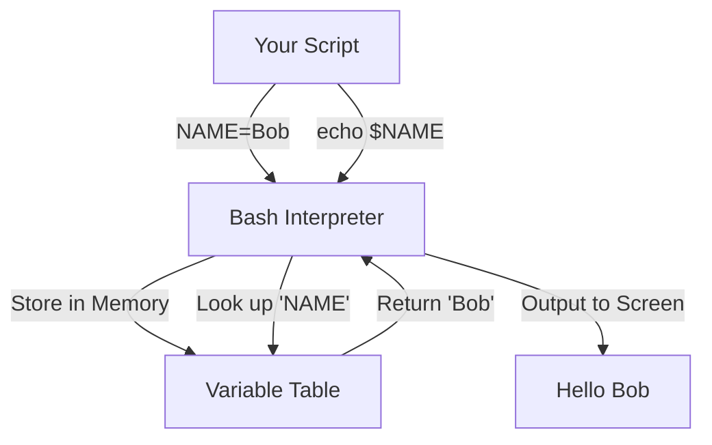

Version: 1.0.0
Last Updated: 2026-03-09
Prerequisites: Module 2 (Linux)

## 1. Shell Architecture and Variables

### Story Introduction

Imagine a **Language Interpreter in a Foreign Court**.

The King (The Kernel) speaks a language of 1s and 0s. You (The User) speak English. You can't talk to the King directly because he's too busy managing the kingdom's resources.

Instead, you talk to the **Interpreter (The Shell)**.
1.  You say, "Please list the files in this room."
2.  The Interpreter understands your command (`ls`), translates it into the King's language, and gives the King the instruction.
3.  The King gives the list to the Interpreter, who then translates it back to English for you.

**Variables** are the Interpreter's **Notebook**. If you tell the Interpreter, "My name is Bob," he writes `NAME=Bob` in his notebook. Later, if you say, "Greet me," he looks in his notebook and says, "Hello, Bob!"

### Concept Explanation

A **Shell** is a command-line interpreter. **Bash** (Bourne Again SHell) is the most common shell on Linux.

#### Key Concepts:
*   **The Shebang (`#!`)**: The first line of a script. It tells the kernel which interpreter to use to run the file (e.g., `#!/bin/bash`).
*   **Variables**: Placeholders for data.
    *   **User-defined**: `MY_VAR="Hello"`
    *   **Environment Variables**: System-wide variables (e.g., `PATH`, `USER`, `HOME`).
*   **Quoting**:
    *   `"Double quotes"`: Allow variable expansion (e.g., `"Hello $USER"` becomes `"Hello abhishek"`).
    *   `'Single quotes'`: Literal strings. No expansion (e.g., `'Hello $USER'` stays `'Hello $USER'`).

### Code Example

```bash
#!/bin/bash
# fundamentals.sh - A script to demonstrate variables and quoting

# 1. Defining a variable
GREETING="Welcome to DevOps"
STUDENT_NAME=$USER # Using an environment variable

# 2. Using variables with different quotes
echo "Double Quotes: $GREETING, $STUDENT_NAME!" 
echo 'Single Quotes: $GREETING, $STUDENT_NAME!'

# 3. Command Substitution
CURRENT_TIME=$(date)
echo "The current time recorded in my notebook is: $CURRENT_TIME"

# 4. Read-only variables
readonly SECRET_KEY="XYZ-123"
# SECRET_KEY="NEW-KEY" # This would cause an error!
```

### Step-by-Step Walkthrough

1.  **`#!/bin/bash`**: This is the "Shebang." It ensures that even if you are using a different shell (like Zsh), this script will always run in Bash.
2.  **`STUDENT_NAME=$USER`**: Here we are "assigning" the value of the system's `$USER` variable to our own variable.
3.  **`$(date)`**: This is **Command Substitution**. It runs the `date` command and immediately places its output into the string.
4.  **`readonly`**: This locks the variable. It's great for security and preventing accidental bugs in large scripts.

### Diagram



### Real World Usage

In **Docker and Kubernetes**, we use environment variables to configure applications without changing their code. For example, a database password might be passed into a container as a variable called `DB_PASSWORD`. The application's Bash entrypoint script reads this variable to connect to the database.

### Best Practices

1.  **Quote your variables**: Always use `"$VAR"` instead of `$VAR`. This prevents errors if the variable contains spaces.
2.  **Use Meaningful Names**: Use `BACKUP_DIR` instead of `D`.
3.  **Local Variables in Functions**: Use the `local` keyword inside functions to prevent "polluting" the rest of your script with temporary data.

### Common Mistakes

*   **Spaces in Assignment**: Writing `NAME = "Bob"` (with spaces) instead of `NAME="Bob"`. Bash will think `NAME` is a command and `=` is an argument!
*   **Forgetting the `$`**: Trying to use a variable with `echo NAME` instead of `echo $NAME`.
*   **Not setting executable permissions**: Creating a script and trying to run it with `./script.sh` without first running `chmod +x script.sh`.

### Exercises

1.  **Beginner**: Create a script that stores your favorite food in a variable and prints it.
2.  **Intermediate**: What is the result of `echo 'Value is $PATH'`? Why?
3.  **Advanced**: How can you make a variable available to child processes started by your script? (Hint: Use the `export` command).

### Mini Projects

#### Beginner: The "Personal Greeter" Script
**Task**: Write a script that asks for the user's name and age. Store them in variables and print a message saying "Hello [NAME], in 10 years you will be [AGE+10] years old."
**Deliverable**: The `greeter.sh` script.

#### Intermediate: The Environment Audit
**Task**: Write a script that checks if three specific environment variables exist: `USER`, `HOME`, and `SHELL`. For each one, print its value. 
**Deliverable**: A script that provides a clean summary of these system settings.

#### Advanced: Simple Configuration Loader
**Task**: Create a text file called `config.env` with the line `API_KEY=ABC12345`. Write a Bash script that "sources" this file and uses the `API_KEY` variable.
**Deliverable**: The `config.env` and the `loader.sh` script that demonstrates loading external settings.
