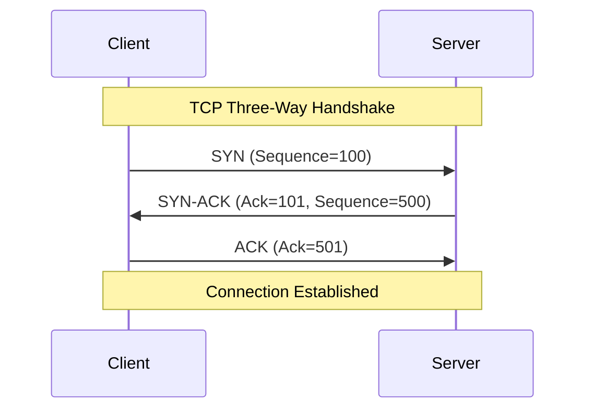

Version: 1.0.0
Last Updated: 2026-03-09
Prerequisites: Module 2.3 (Networking and Monitoring)

## 1. The OSI Model: The 7-Layer Cake

### Story Introduction

Keep in mind **An International Business Deal**.

1.  **Layer 7 (Application)**: You decide to write a contract (The Data). 
2.  **Layer 6 (Presentation)**: You translate the contract into a common language (Encoding/Encryption).
3.  **Layer 5 (Session)**: You call your partner to make sure they are ready to receive it (Establishing a session).
4.  **Layer 4 (Transport)**: You decide whether to send it via a Secure Courier (TCP - reliable) or just post it and hope for the best (UDP - fast).
5.  **Layer 3 (Network)**: You write the full global address on the envelope (IP Address).
6.  **Layer 2 (Data Link)**: You give the envelope to your local mailman (MAC Address/Switch).
7.  **Layer 1 (Physical)**: The actual airplane and truck that carries the paper (Cables/Light/Radio).

Without these rules, the contract would never reach the other side.

### Concept Explanation

The **OSI Model** is a theoretical framework, while the **TCP/IP Model** is the one actually used on the internet.

#### TCP vs UDP (Layer 4):
*   **TCP (Transmission Control Protocol)**: "The Polite Protocol." It performs a "Three-Way Handshake" (SYN -> SYN-ACK -> ACK) and ensures every packet is received in order. Used for: HTTP, SSH, Databases.
*   **UDP (User Datagram Protocol)**: "The Shout Protocol." It just sends data and doesn't care if it arrives. Used for: Streaming, Gaming, Voice over IP (VoIP).

#### IP Addresses (Layer 3):
*   **IPv4**: 32-bit (e.g., `192.168.1.1`). Limited addresses.
*   **IPv6**: 128-bit (e.g., `2001:0db8:85a3...`). Virtually unlimited addresses for every atom on earth.

### Code Example (Simulating the Handshake)

We can't easily "write" a protocol in Bash, but we can watch one using `tcpdump`.

```bash
# Listen for a TCP Three-Way Handshake on port 80
sudo tcpdump -i any port 80 -n

# Output will look something like this:
# [S]   -> SYN (Client wants to connect)
# [S.]  -> SYN-ACK (Server says 'Okay, let's talk')
# [.]   -> ACK (Client says 'I'm starting to send data now')
```

### Step-by-Step Walkthrough

1.  **`sudo tcpdump`**: This tool "sniffs" the network at Layer 2/3.
2.  **`-i any`**: Listen on all network interfaces (Ethernet, WiFi, etc.).
3.  **`port 80 -n`**: Only show traffic for the web port (80) and don't try to translate IPs into names (faster).
4.  **The Flags**: `[S]` stands for **Syn**chronize. This is the first "Hello" in the world of TCP.

### Diagram



### Real World Usage

In **Kubernetes and Cloud Networking**, understanding layers is vital. For example, a "Layer 4 Load Balancer" only knows about IP addresses and Ports. A "Layer 7 Load Balancer" (Ingress Controller) can look at the actual HTTP URL and decide which service should handle the request based on the path (e.g., `/api` vs `/login`).

### Best Practices

1.  **Prefer TCP for Critical Data**: Always use TCP for things like file transfers and database updates where data integrity is more important than speed.
2.  **Use UDP for High-Speed Streams**: If you are building a video streaming app, use UDP. If one packet is lost, the video might stutter for a millisecond, but the stream keeps going.
3.  **Master the `tcpdump` syntax**: Being able to filter traffic by port, IP, or protocol is the "superpower" of a senior DevOps engineer.

### Common Mistakes

*   **Configuring the Wrong Layer**: Trying to fix a "Login Error" (Layer 7) by changing "Firewall Rules" (Layer 3/4).
*   **Forgetting the MTU**: Sending packets that are too large for the physical cables (Layer 1) to handle, causing them to be fragmented and slowing down the whole network.
*   **Ignoring Latency**: Thinking that high bandwidth (big pipe) is the same as low latency (fast pipe). TCP suffers significantly from high latency due to the handshake and acknowledgment process.

### Exercises

1.  **Beginner**: Which layer of the OSI model does an IP address belong to?
2.  **Intermediate**: What are the three steps in the TCP Three-Way Handshake?
3.  **Advanced**: Why do we say that UDP is "Stateless" while TCP is "Stateful"?

### Mini Projects

#### Beginner: The Packet Sniffer
**Task**: Install `tcpdump`. Run it while you open a website in your browser. Identify at least one "SYN" flag in the output.
**Deliverable**: A snippet of your `tcpdump` output highlighting the SYN flag.

#### Intermediate: TCP vs UDP Latency Test
**Task**: Use a tool like `iperf` or `nc` (Netcat) to send a large file over your local network once using TCP and once using UDP. Compare the time taken.
**Deliverable**: A short report showing which was faster and by how much.

#### Advanced: Design a Fault-Tolerant Application
**Task**: Imagine you are building a real-time multiplayer game. Which parts of the data (Player movement, Chat messages, Global scoreboards) should use TCP and which should use UDP?
**Deliverable**: A table justifying your choice for each data type based on the OSI Layer 4 trade-offs.
