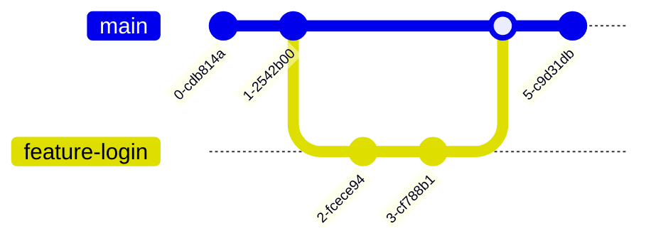

Version: 1.0.0
Last Updated: 2026-03-09
Prerequisites: Module 5.1 (Git Fundamentals)

## 1. Branches: Feature Development

### Story Introduction

Keep in mind **A Multi-Track Recording Studio**.

1.  **The Master Track (Main)**: This is the final song. You never want to record directly onto this because you might hit a wrong note and ruin the whole recording.
2.  **The Vocal Track (Feature Branch)**: The singer takes a copy of the music and records their part in a separate room. If they mess up, they just delete that track; the Master Track stays perfect.
3.  **Mixing (Merging)**: Once the singer is happy with their part, the producer takes the Vocal Track and "mixes" it into the Master Track. Now the song is better, and the feature is live.

In Git, **Branches** allow dozens of developers to work on the same project at the same time without stepping on each other's toes.

### Concept Explanation

A **Branch** is a pointer to a specific commit. When you create a branch, you are effectively creating a "Parallel Universe" where you can experiment safely.

#### Key Operations:
*   **`git branch [name]`**: Creates a new universe.
*   **`git checkout [name]`** (or `git switch [name]`): Travels to that universe.
*   **`git merge [name]`**: Combines the changes from one universe into another.

#### Merge Strategies:
1.  **Fast-Forward**: If the `main` branch hasn't moved since you branched off, Git simply moves the `main` pointer forward to your latest commit.
2.  **Three-Way Merge**: If both `main` and your branch have new commits, Git creates a new "Merge Commit" that ties the two histories together.

### Code Example (Branching and Merging)

```bash
# 1. Create and switch to a new branch
git checkout -b feature-login

# 2. Make some changes and commit
echo "Login logic" > login.txt
git add login.txt
git commit -m "Added login functionality"

# 3. Switch back to 'main'
git checkout main

# 4. Merge the feature into main
git merge feature-login

# 5. Delete the feature branch (optional)
git branch -d feature-login
```

### Step-by-Step Walkthrough

1.  **`git checkout -b`**: This is a shortcut. It creates the branch AND switches you to it immediately.
2.  **Working in isolation**: While you were in `feature-login`, your teammate could have been in `feature-payment`. Neither of you saw each other's files until the merge.
3.  **`git merge`**: This command says "Bring the work from `feature-login` into my *current* branch (which is `main`)."
4.  **`git branch -d`**: Once the "mixing" is done, we throw away the temporary "vocal track" to keep the studio clean.

### Diagram



### Real World Usage

In **Professional Software Teams**, we follow the **"No Commits to Main"** rule. Developers work in "Feature Branches." When they finish, they open a **Pull Request (PR)**. A senior engineer reviews the code in that branch, and only then is it merged into `main`. This ensures the `main` branch is always stable and ready for production.

### Best Practices

1.  **Branch for everything**: Fixing a typo? Create a branch. Adding AI? Create a branch.
2.  **Keep branches short-lived**: Don't work on a branch for 2 weeks. Merge it back to `main` as soon as the feature is done to avoid "Merge Hell."
3.  **Sync with Main often**: While in your feature branch, run `git merge main` regularly to bring in other people's changes. This makes the final merge much easier.

### Common Mistakes

*   **Merging the wrong way**: Accidentally merging `main` into your `feature` branch and then trying to push (you should be merging `feature` into `main`).
*   **Forgotten Commits**: Trying to switch branches while you have unsaved changes. (Solution: Use `git stash` to temporarily hide your work).
*   **Massive Merges**: Trying to merge a feature that changed 1,000 files. This will almost certainly cause complex conflicts.

---

## 2. Managing Merge Conflicts

### Concept Explanation

A **Merge Conflict** happens when two people change the *exact same line* in the *exact same file*. Git doesn't know which one is correct, so it stops the merge and says, "You decide!"

### Code Example (The Conflict)

Git will mark the file like this:
```text
<<<<<<< HEAD
Hello, this is the Main branch version.
=======
Hi, this is the Feature branch version!
>>>>>>> feature-login
```

**How to Fix It**:
1.  Open the file in a text editor.
2.  Delete the `<<<<`, `====`, and `>>>>` markers.
3.  Keep the version you want (or combine both).
4.  `git add` the file and `git commit` to finish the merge.

### Exercises

1.  **Beginner**: What is the command to create a new branch called `bugfix`?
2.  **Intermediate**: What happens during a "Fast-Forward" merge?
3.  **Advanced**: You have a conflict in `index.html`. After you edit the file and resolve the conflict, what is the next Git command you must run?

### Mini Projects

#### Beginner: The Parallel Feature
**Task**: Create a repo. In `main`, create `file.txt`. Create a branch `feature-A`, change the file, and commit. Switch back to `main`, merge `feature-A`.
**Deliverable**: Run `git log --graph --oneline` to see the merge history.

#### Intermediate: The Conflict Resolution Lab
**Task**: Create a conflict intentionally. In `main`, change Line 1 of `file.txt` to "Main". Create a branch, change Line 1 of `file.txt` to "Feature". Merge the branch into `main`.
**Deliverable**: A screenshot of the file *during* the conflict and your resolved version.

#### Advanced: The Branching Strategy Design
**Task**: You are leading a team of 5 developers. Design a strategy for how they should use branches (e.g., Should they use `develop`, `staging`, and `main` branches?).
**Deliverable**: A short document (or diagram) explaining your "Git Workflow" and why it's better for stability.
