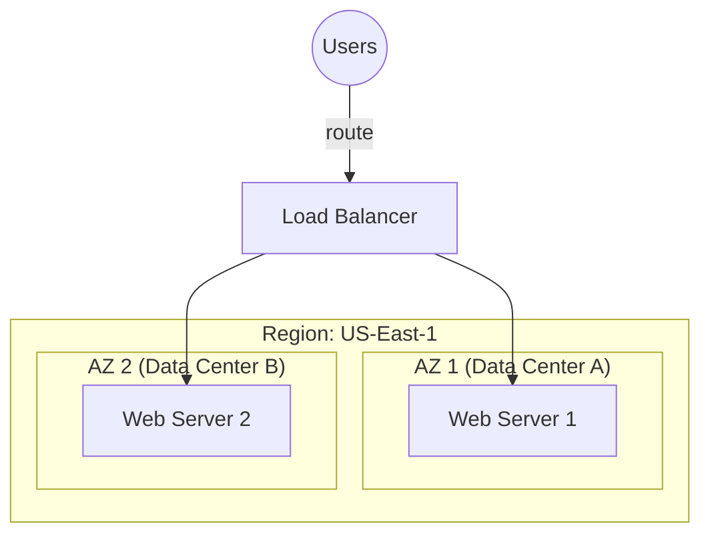

Version: 1.0.0
Last Updated: 2026-03-09
Prerequisites: Module 6.1 & 6.2

## 1. Regions, Availability Zones (AZs), and Edge Locations

### Story Introduction

Keep in mind **Opening a Global Chain of Coffee Shops**.

1.  **Region**: You decide to open shops in **New York**. This is your Region. It's a geographical city.
2.  **Availability Zones (AZs)**: Inside New York, you don't just open 1 shop. You open 3 shops in 3 different buildings. If one building has a fire or a power outage, the other two shops keep selling coffee. These buildings are your AZs. They are physically separate but connected by fast roads (High-speed fiber).
3.  **Edge Locations**: You have a small "Express Cart" in a busy train station in New Jersey. It doesn't brew the coffee; it just holds the hottest, most popular coffee so people can grab it instantly without traveling all the way to New York. This is an **Edge Location** (Content Delivery Network - CDN).

### Concept Explanation

The physical infrastructure of the cloud is organized to provide maximum reliability.

#### The Physical Hierarchy:
*   **Region**: A complex of data centers in a specific area (e.g., `us-east-1` in Virginia).
*   **Availability Zone (AZ)**: One or more discrete data centers with redundant power, networking, and connectivity in an AWS Region.
*   **Edge Location**: Local data centers used for caching data (Content Delivery Network - CDN) to reduce latency for users.

#### Scaling Strategies:
1.  **Vertical Scaling (Scaling Up)**: Increasing the size of an existing server (Adding more RAM or CPU). 
    *   *Limit*: There is a physical limit to how big a single server can be.
2.  **Horizontal Scaling (Scaling Out)**: Adding more servers to your fleet. 
    *   *Benefit*: Virtually infinite! You can handle 10,000 requests by adding 100 small servers.

---

## 2. High Availability (HA) vs. Fault Tolerance

### Concept Explanation

*   **High Availability (HA)**: Ensuring your app is "Always Up." If one server fails, another takes over in seconds. (99.9% uptime).
*   **Fault Tolerance**: Ensuring there is "Zero Downtime" and "Zero Data Loss." This is much more expensive and complex.
*   **Elasticity**: The ability to *automatically* add or remove resources based on demand.

### Code Example (Auto-Scaling Logic)

Cloud providers use **Auto-Scaling Groups**. Here is the logic:

```bash
# Pseudocode for an Auto-Scaling Rule
IF AVERAGE_CPU_USAGE > 80% FOR 5 MINUTES:
    ADD 2 MORE SERVERS TO THE FLEET
    SEND ALERT TO SLACK "Scaling Out due to High Load"

IF AVERAGE_CPU_USAGE < 30% FOR 20 MINUTES:
    REMOVE 1 SERVER FROM THE FLEET
    SEND ALERT TO SLACK "Scaling In to save money"
```

### Step-by-Step Walkthrough

1.  **The Trigger**: A metric (like CPU or RAM) is monitored 24/7.
2.  **The Threshold**: 80% is the "danger zone."
3.  **The Action**: The Cloud Controller commands the Hypervisor (Module 6.2) to start 2 new VMs instantly.
4.  **Registration**: These new servers are automatically added to the Load Balancer (Module 4.4).

### Diagram



### Real World Usage

During the **Super Bowl** or **Black Friday**, websites like Amazon or Netflix experience massive spikes in traffic. They don't buy new servers for these events. They use **Auto-Scaling**. As millions of people log in, their "Cloud Infrastructure" automatically grows from 10,000 to 50,000 servers in minutes, then shrinks back down when the event is over.

### Best Practices

1.  **Always Multi-AZ**: Never put all your servers in a single AZ. If that data center fails (e.g., a lightning strike), your entire business goes dark.
2.  **Scale Out, Not Up**: It's almost always cheaper and more reliable to use many small servers (Horizontal) than one giant server (Vertical).
3.  **Use CDNs (Edge Locations)**: Put your images and videos at the Edge. This keeps your main servers fast and reduces the "Wait time" for users.

### Common Mistakes

*   **Ignored Regions**: Hardcoding your app to work only in one region. If that region has a "Global Outage," you're stuck.
*   **Aggressive Scaling**: Setting your trigger too low (e.g., 50% CPU), causing your infrastructure to constantly grow and shrink, which can actually cause instability.
*   **No "Maximum" Limit**: Forgetting to set a "Max Servers" limit. If your site gets a DDoS attack, the auto-scaling might try to start 1,000,000 servers, resulting in a million-dollar bill!

### Exercises

1.  **Beginner**: What is the difference between a Region and an Availability Zone?
2.  **Intermediate**: When would you choose Vertical Scaling over Horizontal Scaling?
3.  **Advanced**: Why do we use "High-speed, low-latency fiber" to connect Availability Zones instead of just using the public internet?

### Mini Projects

#### Beginner: The Global Latency Check
**Task**: Use `ping` to check the latency to a server in your own country vs. a server in a different continent (you can find public IPs for different AWS regions online).
**Deliverable**: A comparison of the two "Round-trip times" (RTT) and an explanation of why Regions matter for user experience.

#### Intermediate: The Edge Content Finder
**Task**: Use `curl -I` on a large image from a site like Wikipedia or Unsplash. Look for a header like `X-Cache` or `Cloudflare-Ray`.
**Deliverable**: A screenshot of the header proving that the file was served from an "Edge Location."

#### Advanced: Design a "Disaster Recovery" Plan
**Task**: You have a critical application in Virginia (`us-east-1`). Design a plan for what happens if the *entire* state of Virginia loses internet.
**Deliverable**: A 1-page report explaining how you would use "Cross-Region Replication" to keep your business running in Oregon or Ireland.
