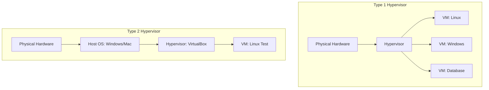

Version: 1.0.0
Last Updated: 2026-03-09
Prerequisites: Module 6.1 (Cloud Concepts)

## 1. What is Virtualization?

### Story Introduction

Imagine **A Large House with Multiple Renters**.

1.  **The Physical House (The Server)**: A massive building with 10 bedrooms, 10 bathrooms, and 1 large kitchen.
2.  **The Problem**: If only one person (One Application) lives in this giant house, 90% of the space is wasted.
3.  **The Solution (Virtualization)**: You put up thin, soundproof walls (The Hypervisor). Now, instead of one giant house, you have 10 separate apartments (Virtual Machines).
4.  **The Benefits**: Each renter thinks they live in their own private house. They can't see each other. They have their own door locks. But they all share the same plumbing and foundation (The Hardware).

Virtualization allows us to run multiple "Fake" computers on one "Real" computer.

### Concept Explanation

Virtualization is the process of creating a software-based (virtual) version of something, such as computing, storage, or networks.

#### Key Components:
1.  **The Host**: The physical hardware (The Real Server).
2.  **The Guest**: The Virtual Machine (VM) running on the host.
3.  **The Hypervisor**: The specialized software that manages the VMs and shares the Host's CPU, RAM, and Disk among them.

#### Types of Hypervisors:
*   **Type 1 (Bare Metal)**: Runs directly on the physical hardware. Very fast and secure. Used in data centers and clouds (AWS, Azure).
    *   *Examples*: VMware ESXi, KVM, Microsoft Hyper-V.
*   **Type 2 (Hosted)**: Runs as an application on top of an existing OS (like Windows or Mac). Slow but great for testing.
    *   *Examples*: Oracle VirtualBox, VMware Workstation.

### Code Example (KVM - Managing VMs via Command Line)

```bash
# 1. Check if your hardware supports virtualization
egrep -c '(vmx|svm)' /proc/cpuinfo

# 2. List running Virtual Machines
virsh list --all

# 3. Create a new VM from a template
virt-install \
    --name ubuntu-server \
    --ram 2048 \
    --vcpus 2 \
    --disk path=/var/lib/libvirt/images/ubuntu.qcow2,size=20 \
    --os-type linux \
    --network bridge=br0
```

### Step-by-Step Walkthrough

1.  **`egrep -c`**: This checks if the CPU has the "Instructions" needed for virtualization (VMX for Intel, SVM for AMD). If it returns 0, you can't run Type 1 VMs.
2.  **`virsh`**: The standard command-line tool for managing VMs in Linux (using KVM).
3.  **`virt-install`**: This is the "Architect." It tells the hypervisor to carve out 2GB of RAM and 20GB of disk space and "pretend" to be a real computer named `ubuntu-server`.

### Diagram



### Real World Usage

Cloud providers (like AWS) don't give you a whole physical machine when you rent an "Instance." They give you a **Virtual Machine**. They use a hypervisor called **KVM** (or Nitro) to split a massive server with 1TB of RAM into 100 small instances for 100 different customers. This is how they make the cloud "Infinite"—by slicing it into tiny pieces.

### Best Practices

1.  **Use Type 1 for Production**: Never run a production database on a Type 2 hypervisor (like VirtualBox). The performance loss is too high.
2.  **Allocate Resources Carefully**: Don't give a VM 16GB of RAM if it only uses 1GB. You are "starving" other VMs on the same host.
3.  **Enable Hardware Acceleration**: Always ensure "VT-x" or "AMD-V" is enabled in your BIOS before setting up a virtualization server.

### Common Mistakes

*   **Virtualization of Virtualization (Nested)**: Running a VM inside another VM. It works, but it is extremely slow.
*   **Assuming VMs are Identical to Hardware**: VMs can sometimes have "Clock Drift" or lag during heavy I/O because they are sharing physical cables with 10 other VMs.
*   **Snapshot Overload**: Taking 50 "Snapshots" (Save points) of a VM and never deleting them. This eventually fills up the disk and slows down the VM.

### Exercises

1.  **Beginner**: What is the difference between a "Host" and a "Guest"?
2.  **Intermediate**: Why is a Type 1 hypervisor more efficient than a Type 2 hypervisor?
3.  **Advanced**: What is "V-Motion" or "Live Migration"? (Hint: It involves moving a VM from one physical server to another without turning it off).

### Mini Projects

#### Beginner: The Hypervisor Identification
**Task**: Open your Task Manager (Windows) or Activity Monitor (Mac). Look for signs of virtualization (e.g., "Virtualization: Enabled").
**Deliverable**: A 1-sentence confirmation of whether your current machine is ready for virtualization.

#### Intermediate: VirtualBox Setup
**Task**: Download and install Oracle VirtualBox. Create a VM and install a lightweight Linux distro (like Lubuntu or Alpine).
**Deliverable**: A screenshot of your Linux VM running inside your main OS.

#### Advanced: Designing a "Private Cloud"
**Task**: You have 5 old physical servers. You want to turn them into a private cloud for your development team.
**Deliverable**: A 1-paragraph explanation of which hypervisor (Type 1 or 2) you would install on those servers and how you would manage them.
