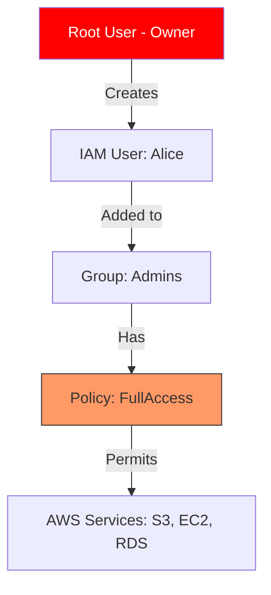

Version: 1.0.0
Last Updated: 2026-03-09
Prerequisites: Module 6 (Cloud Computing Fundamentals)

## 1. What is AWS? (Amazon Web Services)

### Story Introduction

Imagine **The World's Largest Construction Site**.

Instead of buying your own bricks, hiring your own cranes, and digging your own holes, you go to a giant warehouse called **AWS**. 
*   They provide the bricks (**Storage/S3**).
*   They provide the laborers (**Compute/EC2**).
*   They provide the security guards (**IAM**).
*   They even provide the architects (**CloudFormation/Terraform**).

You only pay for the bricks you use and the hours your laborers work. If you want to build a small garden shed, you can. If you want to build a 100-story skyscraper tomorrow, you can do that too, without waiting.

### Concept Explanation

AWS is the world's most comprehensive and broadly adopted cloud platform, offering over 200 fully featured services from data centers globally.

#### The Shared Responsibility Model:
*   **AWS is responsible for "Security OF the Cloud"**: The physical data centers, the hardware, the cables, and the hypervisor.
*   **YOU are responsible for "Security IN the Cloud"**: Your data, your passwords, your firewall settings, and your application code.

---

## 2. IAM (Identity and Access Management)

### Concept Explanation

IAM is the most important service in AWS. It controls **WHO** can access **WHAT** in your account.

#### The 4 Core Components of IAM:
1.  **Users**: Physical people (e.g., Alice, Bob).
2.  **Groups**: Collections of users (e.g., "Developers," "Admins"). It's easier to manage permissions for a group than for 100 individual users.
3.  **Roles**: Identities meant to be assumed by **Services** (e.g., giving an EC2 server permission to read a specific S3 bucket).
4.  **Policies**: JSON documents that describe the permissions. (e.g., "Alice is allowed to see the list of files but not delete them").

### Code Example (An IAM Policy)

This is what a "Permission Rule" looks like in AWS:

```json
{
    "Version": "2012-10-17",
    "Statement": [
        {
            "Effect": "Allow",
            "Action": "s3:ListBucket",
            "Resource": "arn:aws:s3:::my-company-data"
        },
        {
            "Effect": "Deny",
            "Action": "s3:DeleteObject",
            "Resource": "arn:aws:s3:::my-company-data/*"
        }
    ]
}
```

### Step-by-Step Walkthrough

1.  **`Effect: Allow`**: This confirms that the person or service *can* do the following action.
2.  **`Action: s3:ListBucket`**: This is the specific "Verb." It allows the user to see the names of the files in the bucket.
3.  **`Resource`**: This is the "Object." It specifies exactly *which* bucket we are talking about.
4.  **`Effect: Deny`**: Safety first! This explicitly prevents the user from deleting anything in that bucket, even if they have other permissions that might allow it. **Deny always wins over Allow.**

### Diagram



### Real World Usage

In **DevSecOps**, we follow the **Principle of Least Privilege**. Developers aren't given "Admin" access. Instead, they are given a "Developer Role" that only allows them to view logs and deploy code to the "Development" account. This ensures that a single compromised password can't destroy the entire production environment.

### Best Practices

1.  **Stop Using the Root Account**: Create an IAM user for yourself and use that for daily tasks. Lock the Root account away with MFA (Multi-Factor Authentication).
2.  **Enable MFA Everywhere**: For every human user in your account, require a hardware token or an app (like Google Authenticator).
3.  **Use Groups, Not Users**: Don't attach policies directly to Alice. Put Alice in the `Developers` group and attach the policy to the group.
4.  **Use Roles for Apps**: Never put AWS Access Keys (`AKIA...`) inside your application code. Use IAM Roles to give your servers temporary, secure credentials.

### Common Mistakes

*   **Sharing Access Keys**: Two developers using the same set of keys. If one person deletes a database, you won't know who did it!
*   **Permissive Roles**: Giving a role "Full S3 Access" when it only needs to read one specific file.
*   **Public Access Keys on GitHub**: Accidentally committing your AWS keys to a public Git repository. There are "bots" out there that will find those keys in 5 seconds and spend $10,000 on Bitcoin mining in your account!

### Exercises

1.  **Beginner**: What does IAM stand for?
2.  **Intermediate**: What is the difference between an IAM User and an IAM Role?
3.  **Advanced**: Why does an explicit `Deny` in a policy override an `Allow`?

### Mini Projects

#### Beginner: The IAM Audit
**Task**: Sign in to the AWS Console. Go to the IAM dashboard. Identify how many users have MFA enabled.
**Deliverable**: A short message confirming that you have (or will) enable MFA on your main user account.

#### Intermediate: The S3 Access Policy
**Task**: Write a JSON policy that allows a user to "Get" (Download) objects from a bucket named `my-public-photos`, but forbids them from "Uploading" anything.
**Deliverable**: The JSON policy document.

#### Advanced: Designing a Secure Onboarding
**Task**: A new hire, Dave, joins the "Support" team. He needs to be able to see the status of servers (EC2) and view logs (CloudWatch), but he should not be able to stop or terminate any servers.
**Deliverable**: A plan for which IAM Group you would create, which AWS-managed policies you would attach, and how you would verify his access.
