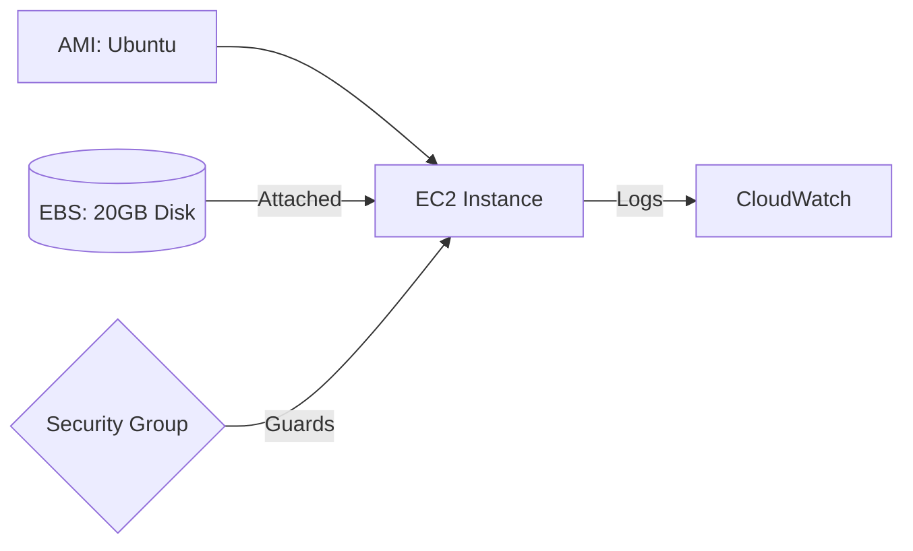

Version: 1.0.0
Last Updated: 2026-03-09
Prerequisites: Module 7.1 & Module 6.2

## 1. Amazon EC2 (Elastic Compute Cloud)

### Story Introduction

Keep in mind **Renting a Computer vs. Buying One**.

In the old days, if you wanted to run a website, you had to go to a store, buy a physical box (Server), and plug it into a wall. If the CPU was too slow, you were stuck with it.

With **EC2**, you are renting a "Sliver" of a massive supercomputer in an AWS data center.
*   **Instance Type**: Choosing how much "Brain Power" (CPU) and "Memory" (RAM) your rented computer has.
*   **AMI (Amazon Machine Image)**: Choosing the "Outfit" (Operating System) the computer wears (e.g., Ubuntu, Amazon Linux, Windows).
*   **Storage (EBS)**: The "External Hard Drive" you plug into your rented computer.

If you don't need the computer anymore, you just "Terminate" it, and you stop paying immediately.

### Concept Explanation

**EC2** provides resizable compute capacity in the cloud.

#### Key Terminology:
1.  **AMI**: A template that contains the software configuration (OS, application server, and applications). You can use a public AMI or create your own "Golden Image."
2.  **Instance Types**: Optimized for different goals:
    *   **T / M series**: General Purpose (Balanced).
    *   **C series**: Compute Optimized (Good for math/heavy processing).
    *   **R series**: Memory Optimized (Good for big databases).
3.  **Security Groups**: A virtual firewall for your EC2 instance (Layer 4).

#### Purchase Options:
*   **On-Demand**: Pay by the second. Most flexible.
*   **Reserved Instances (RI)**: Commit to 1-3 years for a 70% discount.
*   **Spot Instances**: Bid for unused AWS capacity. Up to 90% cheaper, but AWS can take it back with a 2-minute warning. (Great for Batch Jobs).

### Code Example (Launching an EC2 via Boto3/Python)

DevOps engineers often use Python to automate server creation:

```python
import boto3

ec2 = boto3.resource('ec2')

# Create a new EC2 instance
instances = ec2.create_instances(
     ImageId='ami-0abcdef1234567890', # Ubuntu
     MinCount=1,
     MaxCount=1,
     InstanceType='t2.micro',
     KeyName='my-laptop-key'
)

print(f"Created instance with ID: {instances[0].id}")
```

### Step-by-Step Walkthrough

1.  **`boto3.resource('ec2')`**: This initializes the Python library that talks to the AWS API.
2.  **`ImageId`**: You are telling AWS to install a specific version of Linux.
3.  **`InstanceType: 't2.micro'`**: You are choosing the cheapest, smallest "Lego block" of compute power.
4.  **`KeyName`**: This attaches your SSH public key to the server so you can log in later (Module 2.3).

### Diagram



### Real World Usage

In **Continuous Deployment (CD)**, we use **Auto-Scaling Groups (ASG)**. When a developer pushes new code, the ASG starts a new EC2 instance, installs the new code, and waits for the "Health Check" to pass. Once it's ready, the old server is terminated. The user never sees a "Down for maintenance" screen because there's always a server running.

### Best Practices

1.  **Use Private Subnets**: Most of your EC2 servers (like your App or DB) should not have a Public IP. They should live in a private subnet and be accessed via a Load Balancer (Module 4.4).
2.  **Monitor with CloudWatch**: Set an alarm to alert you if your EC2 CPU usage hits 90% for more than 5 minutes.
3.  **Leverage Spot Instances for Non-Critical Work**: If you are processing data that can be "re-run" later, use Spot instances to save huge amounts of money.
4.  **Tag for Cost Allocation**: Always add tags like `Project=Website` and `Owner=DevOps` so you know where the money is going.

### Common Mistakes

*   **Leaving Instances Running**: Forgetting to stop your "Test" servers on Friday, leading to a surprise bill on Monday.
*   **Over-Provisioning**: Choosing a `c5.xlarge` server when a `t3.small` would have been enough.
*   **Standard Security Group Errors**: Opening port 22 (SSH) to the entire world (`0.0.0.0/0`). This leads to "Brute Force" attacks. Always restrict SSH to your own IP address.

### Exercises

1.  **Beginner**: What is an AMI?
2.  **Intermediate**: When would you use a "Memory Optimized" (R series) instance instead of a "Compute Optimized" (C series) one?
3.  **Advanced**: Explain the benefit of using "Spot Instances" for an image-processing background job.

### Mini Projects

#### Beginner: The Console Launch
**Task**: Sign in to the AWS Console. Launch a `t2.micro` instance using the "Amazon Linux" AMI. Connect to it via EC2 Instance Connect (the web-based terminal).
**Deliverable**: A screenshot of your terminal screen showing the command `uname -a` running on the server.

#### Intermediate: The Web Server Automation
**Task**: Use the "User Data" field during EC2 launch to write a script that automatically installs Nginx and creates a basic "Hello World" HTML page.
**Deliverable**: The URL (Public IP) of your server showing the custom "Hello World" page in a browser.

#### Advanced: Designing a Fault-Tolerant Fleet
**Task**: Design an Auto-Scaling Group that maintains at least 2 servers at all times across 2 different Availability Zones.
**Deliverable**: A simple diagram showing the ASG, the 2 subnets, and the 2 EC2 instances.
