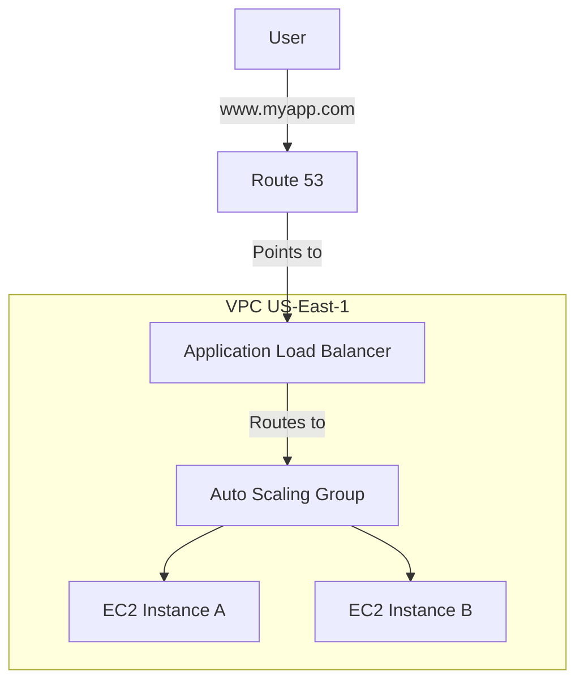

Version: 1.0.0
Last Updated: 2026-03-09
Prerequisites: Module 4.1 & 7.1

## 1. Route 53 (Managed DNS)

### Story Introduction

Keep in mind **The GPS and Address Book for your City**.

If your AWS account is a city, **Route 53** is the GPS that directs every visitor to the right building.
*   **Registration**: You buy your "Street Address" (Domain Name) through them.
*   **Routing**: If someone asks for `shop.example.com`, Route 53 points them to your storefront.
*   **Health Checks**: If a building is on fire, the GPS senses it and automatically redirects all traffic to the building across the street so no one gets hurt.

It is called "Route 53" because it routes traffic through Port 53 (the standard DNS port).

### Concept Explanation

Route 53 is a highly available and scalable DNS web service.

#### Routing Policies (How it decides where to send users):
1.  **Simple Routing**: One record points to one IP. 
2.  **Weighted Routing**: Send 10% of users to a "New Version" of your site and 90% to the "Old Version." (Canary Testing).
3.  **Latency Routing**: Sends the user to the AWS Region that gives them the fastest response time.
4.  **Failover Routing**: Sends users to a "Backup Server" in a different region only if the primary server is down.

---

## 2. Elastic Load Balancing (ELB) and VPC Recap

### Concept Explanation

In AWS, we never give our servers a static public IP. Instead, we put them behind an **ELB**.

#### Types of ELB:
*   **ALB (Application Load Balancer)**: Works at Layer 7 (HTTP/HTTPS). Can route traffic based on the URL (e.g., `example.com/images` goes to one server, `example.com/api` goes to another).
*   **NLB (Network Load Balancer)**: Works at Layer 4 (TCP/UDP). Used for ultra-high performance and millions of requests per second.

#### VPC Recap (The Security Boundary):
Recall your "Gated Community" (Module 4.5). In AWS:
*   **Public Subnet**: Holds the ALB (The Lobby).
*   **Private Subnet**: Holds the EC2 App Servers and RDS Database (The Offices).

### Code Example (Route 53 Health Check with AWS CLI)

```bash
# Create a health check that pings your web server every 30 seconds
aws route53 create-health-check \
    --caller-reference "myapp-health-check-001" \
    --health-check-config '{
        "IPAddress": "1.2.3.4",
        "Port": 80,
        "Type": "HTTP",
        "ResourcePath": "/health",
        "FullyQualifiedDomainName": "example.com"
    }'
```

### Step-by-Step Walkthrough

1.  **`ResourcePath: /health`**: We don't just check if the server is "on." We check a specific file that our app updates only if the database and everything else is working perfectly.
2.  **Health Check Action**: If this pings 3 times and fails, Route 53 will stop sending traffic to `1.2.3.4` and switch to your backup IP automatically.
3.  **ALIAS Records**: In Route 53, you don't point `example.com` to an IP. You point it to your **Load Balancer's DNS name** using an "Alias" record. This is special AWS magic that is faster than a standard CNAME.

### Diagram



### Real World Usage

**Expedia** or **Booking.com** use Latency Routing. If you are in Tokyo, you shouldn't have to wait for a signal to travel to Virginia just to see a hotel price. Route 53 recognizes you are in Japan and sends your request to the `ap-northeast-1` (Tokyo) region, making the site feel "Instant."

### Best Practices

1.  **Use ALIAS records for AWS Resources**: It's faster and free (standard CNAMEs can cost money and add latency).
2.  **Always use ALBs for Web Apps**: It allows you to handle SSL certificates at the balancer (Module 4.3) and scales automatically.
3.  **Perform Internal Health Checks**: Don't just check the port; check the "App Health" endpoint.
4.  **Security Group Layering**: Your EC2 Security Group should only allow traffic from the Load Balancer's Security Group. This "Sandwiches" your app between security layers.

### Common Mistakes

*   **Public IPs on DBs**: Forgetting to use a private subnet, exposing your database to the world.
*   **Invalid Health Checks**: Setting a health check that is too sensitive (e.g., 1 failure), causing your app to "flip-flop" between healthy and unhealthy status.
*   **TTL Confusion**: Setting a high TTL (like 24 hours) for a record you plan to change soon. You will have to wait a full day for the change to reach every user!

### Exercises

1.  **Beginner**: Which service in AWS is used for managing Domain Names?
2.  **Intermediate**: What is the difference between an Application Load Balancer (ALB) and a Network Load Balancer (NLB)?
3.  **Advanced**: How does "Latency Routing" improve the user experience?

### Mini Projects

#### Beginner: The DNS Records Audit
**Task**: Use the `dig` command (Module 4.2) on your favorite website. Identify if they use an A record or a CNAME.
**Deliverable**: The output of the `dig` command highlighting the record type.

#### Intermediate: The Load Balancer Setup
**Task**: Launch two EC2 instances with a basic web server. Create an Application Load Balancer (ALB) in the AWS Console. Add both instances to the ALB's "Target Group."
**Deliverable**: The DNS entry of the Load Balancer. When you refresh the page in your browser, you should intermittently see traffic coming from both Instance A and Instance B.

#### Advanced: FAILOVER Strategy Design
**Task**: You have a website in `us-east-1` (Virginia) and a static copy in S3 in `us-west-2` (Oregon). Design a Route 53 Failover policy that automatically switches users to the S3 bucket if the Virginia servers die.
**Deliverable**: A short architectural description of the "Health Check" and the "Failover" record setup.
