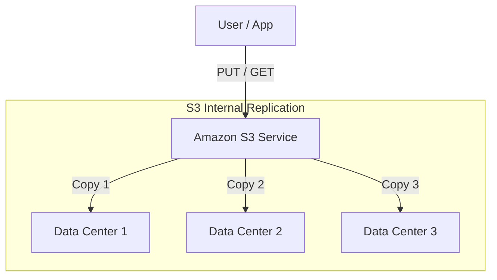

Version: 1.0.0
Last Updated: 2026-03-09
Prerequisites: Module 7.1 (AWS Fundamentals)

## 1. Amazon S3 (Simple Storage Service)

### Story Introduction

Keep in mind **A Giant, Organized Warehouse with Infinite Space**.

1.  **Buckets**: Instead of folders, you have "Buckets." Each bucket must have a name that is unique in the *entire world* (e.g., `my-photos-2026`).
2.  **Objects**: Every file you upload is an "Object." It's not just the file; it's also the "Label" (Metadata) that tells you when it was made and who owns it.
3.  **The Checkout Counter (API)**: You don't "open" an S3 file. You "Request" it via a URL. To download an image, you just go to `https://my-bucket.s3.amazonaws.com/image.jpg`.
4.  **Durability (The 11 Nines)**: AWS stores 3 copies of your file in 3 different buildings. If you store 10 million files, you would statistically only lose ONE file every 10,000 years.

S3 is the safest place on earth to store data.

### Concept Explanation

**S3** is Object Storage (unlike EBS, which is Block Storage for the OS).

#### Storage Classes (The "Cost vs. Speed" Trade-off):
1.  **S3 Standard**: High speed, high cost. For data you use every day.
2.  **S3 Intelligent-Tiering**: Automatically moves your files to cheaper storage if you don't use them. Best for unknown access patterns.
3.  **S3 Glacier**: Very cheap (pennies per month). But it takes minutes to hours to "retrieve" your file. Like a storage unit in another city.
4.  **S3 Glacier Deep Archive**: The cheapest (archival). Takes 12-48 hours to retrieve. For records you must keep for legal reasons but will likely never look at again.

#### Lifecycle Policies:
You can tell S3: "If a file is older than 30 days, move it to Glacier. If it's older than 7 years, delete it." This saves thousands of dollars automatically.

### Code Example (Uploading via AWS CLI)

```bash
# 1. Create a Bucket (Name must be globally unique!)
aws s3 mb s3://abhishek-unique-bucket-2026

# 2. Upload a file
aws s3 cp my-document.pdf s3://abhishek-unique-bucket-2026/

# 3. List the contents
aws s3 ls s3://abhishek-unique-bucket-2026/

# 4. Sync a whole folder (like a backup)
aws s3 sync ./my-local-folder s3://abhishek-unique-bucket-2026/backups/
```

### Step-by-Step Walkthrough

1.  **`mb` (Make Bucket)**: The URL of S3 is global. Your bucket name can't be taken by anyone else in any other account!
2.  **`cp` (Copy)**: This uploads the file to the cloud. S3 then immediately replicates it to multiple data centers.
3.  **`sync`**: This is a powerful command. It compares your local folder to the S3 bucket and *only* uploads the files that have changed. It's the standard for cloud backups.

### Diagram



### Real World Usage

**Netflix** uses S3 to store every movie and show you watch. When you click "Play," the app fetches a "Slice" of that video file from S3. Because S3 can handle millions of people requesting different files at the exact same time, it is the perfect backbone for global streaming services.

### Best Practices

1.  **Block Public Access**: By default, S3 is private. Never "Open" a bucket to the public unless it's for public website images.
2.  **Use Versioning**: If you accidentally delete a file, "Versioning" allows you to "Undo" the deletion.
3.  **Enable Encryption**: Always check the "Server-Side Encryption" box. Even if a hacker broke into the AWS data center and stole the hard drives, they wouldn't be able to read your files.
4.  **Lifecycle Rules for Logs**: Log files are useless after 90 days. Always set a rule to move them to Glacier or delete them.

### Common Mistakes

*   **Public Buckets**: Leaving a bucket wide open, leading to data leaks. This is the #1 cause of AWS security failures.
*   **Unique Name Frustration**: Trying to name a bucket `test` or `backup` and getting angry when it's already taken. (Add your name or a date!).
*   **Glacier Retrieval Shock**: Trying to download a 1TB file from Glacier instantly and realizing you have to wait 5 hours.

### Exercises

1.  **Beginner**: What is the difference between a Bucket and an Object?
2.  **Intermediate**: When would you use S3 Glacier instead of S3 Standard?
3.  **Advanced**: What is a "Pre-signed URL," and why would you use it to share a private file?

### Mini Projects

#### Beginner: The Personal Cloud Drive
**Task**: Create a bucket in S3. Upload 3 photos. Use the "Object Actions" to change the storage class of one photo to "Glacier."
**Deliverable**: A screenshot showing your 3 objects and their different storage classes.

#### Intermediate: The Static Website
**Task**: Create an `index.html` file. Upload it to an S3 bucket. Enable "Static Website Hosting" on the bucket. 
**Deliverable**: Provide the S3 Website URL that displays your HTML page.

#### Advanced: The Automated Backup Script
**Task**: Write a Bash script (Module 3) that uses the `aws s3 sync` command to backup your `Documents` folder to an S3 bucket every time the script is run. 
**Deliverable**: The `.sh` script and a screenshot of your S3 bucket showing the backed-up files.
