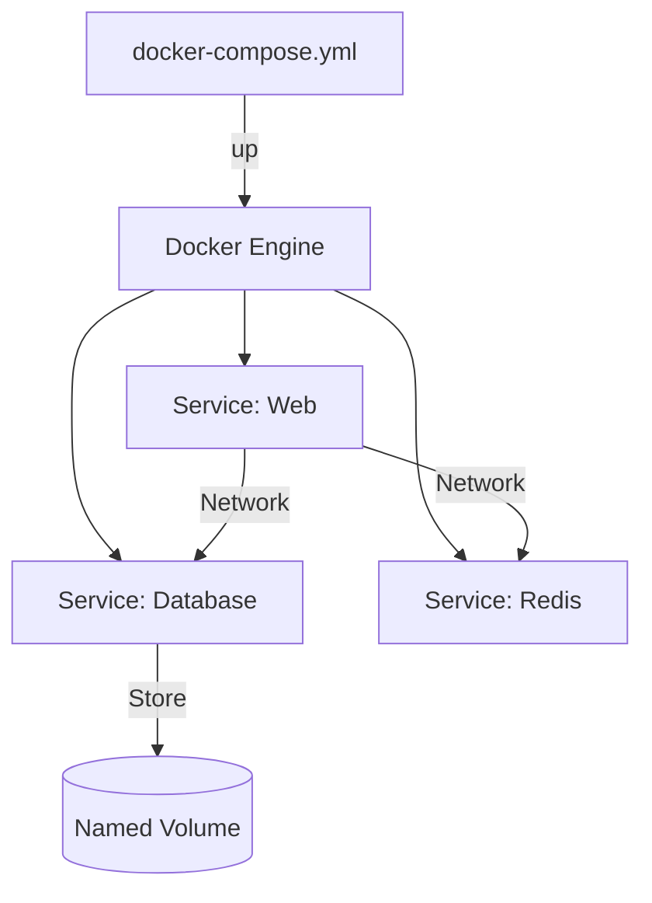

Version: 1.0.0
Last Updated: 2026-03-09
Prerequisites: Module 8.1 - 8.3

## 1. What is Docker Compose?

### Story Introduction

Imagine **Conducting an Orchestra**.

1.  **The Individual Players (Containers)**: You have a violinist (Web), a cellist (Database), and a flutist (Cache).
2.  **The Problem**: If you have to walk up to each person and say "Start playing now," the timing will be terrible. The violinist might start before the cellist is even in their seat.
3.  **The Solution (The Sheet Music / Docker Compose)**: You write down exactly *who* plays, *what* they play, and *the order* they start in. 
4.  **One Command**: You tap your baton (`docker-compose up`), and everyone starts playing perfectly in sync.

Docker Compose allows you to define a multi-container application in a single YAML file and start it with one command.

### Concept Explanation

**Docker Compose** is a tool for defining and running multi-container Docker applications.

#### The `docker-compose.yml` File:
*   **Version**: Which version of the Compose format you are using.
*   **Services**: The individual containers (e.g., `web`, `db`, `redis`).
*   **Volumes**: Definitions for shared storage.
*   **Networks**: Definitions for inter-container communication.

#### Common Commands:
*   **`docker-compose up -d`**: Start the whole app in the background.
*   **`docker-compose down`**: Stop and remove all containers, networks, and images defined in the file.
*   **`docker-compose ps`**: Check the status of the "Orchestra."
*   **`docker-compose logs -f`**: Watch the output from ALL containers in real-time.

### Code Example (A Full Stack App)

```yaml
# docker-compose.yml
version: '3.8'

services:
  web:
    build: . # Build the Dockerfile in the current directory
    ports:
      - "80:5000"
    depends_on:
      - db
    networks:
      - my-net

  db:
    image: postgres:alpine
    environment:
      POSTGRES_PASSWORD: example_password
    volumes:
      - db-data:/var/lib/postgresql/data
    networks:
      - my-net

networks:
  my-net:

volumes:
  db-data:
```

### Step-by-Step Walkthrough

1.  **`build: .`**: Instead of pulling an image from the web, Compose will automatically run the `docker build` command for you (Module 8.2).
2.  **`depends_on`**: This tells Docker, "Don't start the `web` container until the `db` container is running."
3.  **`networks`**: Both services are automatically placed on `my-net`, so the `web` app can connect to `db:5432` without needing an IP address.
4.  **`volumes`**: The `db-data` volume ensures your database data isn't deleted when you run `docker-compose down`.

### Diagram



### Real World Usage

In **Local Development**, Docker Compose is a lifesaver. When a new developer joins the team, they don't have to spend 2 days installing Java, MySQL, and Redis on their laptop. They just clone the Git repo and run `docker-compose up`. Their laptop becomes a perfect replica of the production environment in seconds.

### Best Practices

1.  **Environment Variables**: Use an `.env` file for your passwords and API keys. Docker Compose will automatically read these and inject them into your containers.
2.  **Use specific image versions**: Don't use `postgres:latest`. Use `postgres:14.1-alpine`.
3.  **Keep it Focused**: Don't put your local dev tool and your prod app in the same compose file. Create a `docker-compose.override.yml` for local-only settings.
4.  **Health Checks**: Add a `healthcheck` section to your YAML so Compose knows if a service is *actually* ready, not just "started."

### Common Mistakes

*   **Identation Errors**: YAML is very strict about spaces. One extra space can break the whole file!
*   **Ignoring `down`**: Forgetting that `docker-compose down` deletes your networks. If you have extra containers running on that network, they might lose connectivity.
*   **Absolute Paths in Volumes**: Using `C:\Users\Bob\data` instead of `./data`. This makes the file impossible for your teammate to use on their own machine.

### Exercises

1.  **Beginner**: What is the command to stop all services in a Compose file?
2.  **Intermediate**: What does the `depends_on` keyword do?
3.  **Advanced**: How do you tell Docker Compose to use an existing volume instead of creating a new one?

### Mini Projects

#### Beginner: The Multi-Container Ping
**Task**: Write a `docker-compose.yml` with two services: `serv1` and `serv2` (use the `alpine` image). Set the command for `serv1` to `ping serv2`.
**Deliverable**: Run `docker-compose logs` and prove that `serv1` successfully talked to `serv2`.

#### Intermediate: The WordPress Starter
**Task**: Find the official WordPress Docker Compose example online. Run it on your machine.
**Deliverable**: A screenshot of the "WordPress Installation" page running on `localhost:8080`.

#### Advanced: The Development Override
**Task**: Research `docker-compose.override.yml`. Create a setup where the main file runs your app in "Production Mode," but the override file mounts your local code into the container for "Live Development."
**Deliverable**: Two YAML files and a short explanation of how they merge when you run `docker-compose up`.
