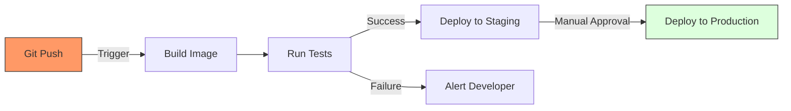

Version: 1.0.0
Last Updated: 2026-03-09
Prerequisites: Module 5 (Git) & Module 8 (Docker)

## 1. What is CI/CD? (Integration, Delivery, Deployment)

### Story Introduction

Imagine **A Car Assembly Line**.

1.  **Continuous Integration (CI)**: As soon as a mechanic (Developer) finishes a car door, they put it on the assembly line. A robot instantly checks if the door fits the frame and if the window rolls down (Tests). If it fails, the robot kicks the door off the line immediately so the mechanic can fix it.
2.  **Continuous Delivery (CD)**: Once the whole car is built and tested, it's moved to a parking lot (Staging). It's ready to be driven. A manager looks at the car and decides when to "Ship" it to the dealership.
3.  **Continuous Deployment (CD)**: There is no manager. As soon as the car is finished and passed all tests, it is automatically teleported to the customer's driveway (Production).

CI/CD is the process that takes code from a developer's brain to a user's screen with zero manual effort.

### Concept Explanation

#### CI: Continuous Integration
*   Developers merge code into the shared `main` branch frequently (Module 5.4).
*   Every merge triggers an **Automated Build** and **Automated Tests**.
*   **Goal**: Find bugs early.

#### CD: Continuous Delivery
*   Every change that passes the CI stage is automatically built as an **Artifact** (like a Docker Image - Module 8.5).
*   The artifact is deployed to a **Staging** environment for final review.
*   **Goal**: The software is *always* in a releasable state.

#### CD: Continuous Deployment
*   Every change that passes all tests is deployed to **Production** automatically.
*   No human intervention is required.
*   **Goal**: Maximum speed and efficiency.

---

## 2. The Anatomy of a Pipeline

### Concept Explanation

A **Pipeline** is a series of steps that your code must go through to get to production.

#### Standard Stages:
1.  **Source**: Triggered when you push code to Git.
2.  **Build**: Compiles code and packages it into a Docker image.
3.  **Test**: Runs Unit Tests, Integration Tests, and Security Scans.
4.  **Deploy**: Sends the artifact to the server (Staging or Production).

### Code Example (A Pipeline Logic)

This is a conceptual "Pipeline" in a simple Bash script (automation is just scripts at the end of the day!):

```bash
#!/bin/bash
# simple-pipeline.sh

echo "STAGE 1: Fetching Code..."
git pull origin main

echo "STAGE 2: Building Artifact..."
docker build -t my-app:latest .

echo "STAGE 3: Running Tests..."
# If tests fail, the script exits here (Module 3.5)
./run-tests.sh || { echo "TESTS FAILED!"; exit 1; }

echo "STAGE 4: Deploying..."
docker push my-app:latest
ssh production-server "docker pull my-app:latest && docker run -d my-app:latest"

echo "PIPELINE SUCCESS!"
```

### Step-by-Step Walkthrough

1.  **The Trigger**: The script starts. In a real world, **Jenkins** or **GitHub Actions** runs this script every time it sees a `git push`.
2.  **`|| { ...; exit 1; }`**: This is the "Fail Fast" mechanism. We never want to deploy code that failed its tests.
3.  **Artifact Creation**: Notice we build the Docker image *once* and then use that exact same image for both testing and deployment.
4.  **Automated Success**: The minute the developer types `git push`, they can go get coffee. The system handles the rest.

### Diagram



### Real World Usage

**Amazon** (the shopping site) deploys new code to production every **11.7 seconds** on average! They don't have a "Release Day." They have a massive CI/CD pipeline that handles tens of thousands of miniature releases every single day, keeping the site competitive and bug-free.

### Best Practices

1.  **Keep it Fast**: A pipeline that takes 2 hours is a bad pipeline. Aim for under 10 minutes.
2.  **Fail Fast**: Run your fastest tests (Unit Tests) first. Don't waste time building a Docker image if a typo broke your code.
3.  **Environment Parity**: Your Staging environment should be an exact copy of Production.
4.  **Log Everything**: When a pipeline fails, it must be easy for the developer to see the logs and fix the problem.

### Common Mistakes

*   **Testing in Production**: Not having a staging environment and hoping the code works once it's live.
*   **Manual Steps**: Having a pipeline that stops and asks "Should I continue?" for every tiny thing.
*   **No Rollbacks**: Having a "Go" button but no "Undo" button when something goes wrong in production.

### Exercises

1.  **Beginner**: What is the difference between Continuous Delivery and Continuous Deployment?
2.  **Intermediate**: What are the four main stages of a typical CI/CD pipeline?
3.  **Advanced**: Why do we prefer putting our application in a Docker container before deploying it via a pipeline? (Hint: Environment Consistency).

### Mini Projects

#### Beginner: The Pipeline Diagram
**Task**: Take a look at a real app you've worked on. Draw a flowchart showing the steps it takes from your machine to the user.
**Deliverable**: A hand-drawn or digital diagram of your "Mental Pipeline."

#### Intermediate: The Bash CI
**Task**: Write a Bash script (Module 3) that acts as a "Local CI." It should `git pull`, run a mock test script (which returns 0 or 1), and then print "BUILD SUCCESS" only if the test passed.
**Deliverable**: The script and an example of it "Failing" when the test returns 1.

#### Advanced: The Pipeline Audit
**Task**: Research the "DORA Metrics" (Deployment Frequency, Lead Time for Changes, etc.).
**Deliverable**: A short summary explaining why "Deployment Frequency" is a key indicator of a healthy engineering team.
