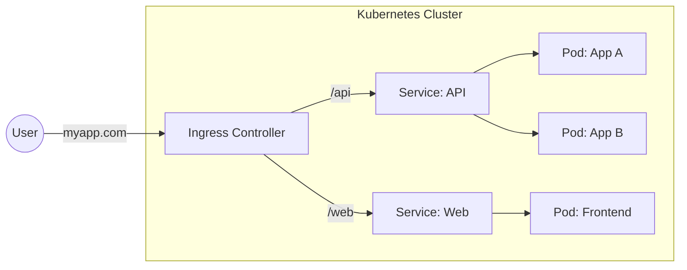

Version: 1.0.0
Last Updated: 2026-03-09
Prerequisites: Module 10.1 & 10.2

## 1. Services: The Permanent Address

### Story Introduction

Imagine **A Pizza Restaurant with 5 Chefs**.

The Chefs (Pods) are constantly changing. Some quit, new ones are hired, and some take breaks (Pods are ephemeral; they die and are replaced).
If a Customer (User) tried to call a specific Chef directly, they would likely fail because that Chef's "Phone Number" (IP Address) changes every day.

Instead, the restaurant has a **Single Front Desk Phone Number (The Service)**.
1.  The Customer calls the Front Desk.
2.  The Front Desk doesn't make the pizza; it just knows which Chefs are currently in the kitchen.
3.  The Front Desk "Connects" the customer's order to one of the working chefs automatically.

In Kubernetes, a **Service** is the "Permanent Face" for a Group of Pods.

### Concept Explanation

A **Service** provides a single, constant IP address and DNS name for a set of Pods.

#### Service Types:
1.  **ClusterIP (Default)**: Internal only. Only other pods inside the cluster can talk to this service. (e.g., for a Database).
2.  **NodePort**: Opens a specific port on every server (Node). Allows external traffic to reach the pods. (e.g., Port 30001).
3.  **LoadBalancer**: Connects to your Cloud Provider (AWS/Azure) and automatically creates a real Load Balancer (Module 7.5) to send internet traffic to your pods.

#### How it finds Pods:
Services use **Selectors** to find Pods with matching **Labels**. If a Pod has the label `app: web`, the service will automatically send traffic to it.

---

## 2. Ingress: The Global Gatekeeper

### Concept Explanation

If you have 100 apps, you don't want 100 separate "LoadBalancer" services (it gets expensive). Instead, you use an **Ingress**.

An **Ingress** is like a fancy Router or a Reverse Proxy (Module 4.4).
*   Traffic for `myapp.com/api` goes to the **API Service**.
*   Traffic for `myapp.com/login` goes to the **Auth Service**.

It uses one single entry point (one IP address) to manage routing for the whole cluster.

### Code Example (Service and Ingress YAML)

```yaml
# service.yml
apiVersion: v1
kind: Service
metadata:
  name: web-service
spec:
  selector:
    app: web # Finds pods with this label
  ports:
    - protocol: TCP
      port: 80 # The service's port
      targetPort: 8080 # The pod's port
  type: ClusterIP
```

```yaml
# ingress.yml
apiVersion: networking.k8s.io/v1
kind: Ingress
metadata:
  name: web-ingress
spec:
  rules:
  - host: myapp.com
    http:
      paths:
      - path: /
        pathType: Prefix
        backend:
          service:
            name: web-service # Points to the service above
            port:
              number: 80
```

### Step-by-Step Walkthrough

1.  **`targetPort`**: This is the "Real" port where your app is listening inside the container.
2.  **`port`**: This is the "Fake" port the service shows to the rest of the cluster.
3.  **`backend`**: In the Ingress file, we don't point to Pods; we point to the **Service Name**. This creates a clean chain: User -> Ingress -> Service -> Pod.
4.  **DNS**: K8s has a built-in DNS service (`CoreDNS`). Any pod can talk to our web service simply by using the name `http://web-service`.

### Diagram



### Real World Usage

In **E-commerce**, we use Ingress for "Path-based Routing." When a user visits `/cart`, they are routed to a microservice written in Node.js. When they visit `/products`, they go to a Java service. To the user, it looks like one big website (`amazon.com`), but behind the scenes, Ingress is splitting the traffic among hundreds of different Kubernetes Services.

### Best Practices

1.  **Use ClusterIP for internal talk**: Never use a NodePort or LoadBalancer for your database. Keep it private!
2.  **Use an Ingress Controller**: Tools like **Nginx Ingress** or **Traefik** are the standard for production.
3.  **Implement Network Policies**: By default, every pod can talk to every other pod. For security, use "Network Policies" (K8s Firewalls) to block unauthorized talk (e.g., prevent the Web pod from talking to the Database pod directly).

### Common Mistakes

*   **Port Confusion**: Setting the `targetPort` incorrectly, so the service connects but the pod doesn't answer.
*   **Selector Typos**: Misspelling a label in the Service selector, so no pods are "found." K8s won't give an error; the service will just be empty.
*   **No Ingress Controller Installed**: Writing an Ingress YAML but forgetting that K8s doesn't have a "Router" by default. You must install a controller like Nginx first.

### Exercises

1.  **Beginner**: Which Service type is used for communication *only* within the cluster?
2.  **Intermediate**: What is the difference between `port` and `targetPort` in a Service manifest?
3.  **Advanced**: Why do we prefer using an Ingress instead of many LoadBalancer services?

### Mini Projects

#### Beginner: The DNS Explorer
**Task**: Start two pods in a cluster. From Pod A, try to `curl` Pod B using its Name (Service Name) rather than its IP.
**Deliverable**: The output of the `curl` command showing a successful response.

#### Intermediate: The Port Forward
**Task**: Use the command `kubectl port-forward svc/[service-name] 8080:80`. Access your internal service from your laptop's browser.
**Deliverable**: A 1-sentence explanation of why `port-forward` is great for debugging but bad for production.

#### Advanced: The Path-Based Router
**Task**: Write an Ingress YAML that routes traffic from `/api` to an `api-service` and all other traffic (`/`) to a `frontend-service`.
**Deliverable**: The YAML manifest for the Ingress resource.
