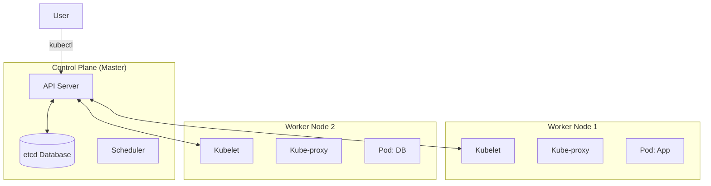

Version: 1.0.0
Last Updated: 2026-03-09
Prerequisites: Module 8 (Docker) & Module 4 (Networking)

## 1. What is Kubernetes? (Container Orchestration)

### Story Introduction

Keep in mind **A Massive Fleet of Shipping Ships**.

1.  **The Containers (Docker)**: You have thousands of individual shipping containers.
2.  **The Problem**: If you have 10 ships (Servers), who decides which container goes on which ship? If a ship sinks, who moves the containers to a different ship? If 100 people want their containers today, who starts more ships?
3.  **The Solution (The Captain / Kubernetes)**: **Kubernetes** (K8s) is the Captain. You give him a list of what you want ("I need 5 copies of the Web App running"). The Captain looks at the ships, finds the one with the most empty space, and puts the containers there. If a server dies, the Captain instantly notices and moves the containers to a healthy server before anyone notices.

Kubernetes is the "Operating System" for the entire data center.

### Concept Explanation

**Kubernetes** (derived from the Greek word for "pilot" or "helmsman") is an open-source system for automating deployment, scaling, and management of containerized applications.

#### Key Architecture:
1.  **Control Plane (The Brain)**: 
    *   **API Server**: The gateway. Everything talks to this.
    *   **etcd**: The cluster's "Memory" (a database of every setting).
    *   **Scheduler**: Decisions on which server (Node) runs which Pod.
2.  **Worker Nodes (The Ships)**:
    *   **Kubelet**: The "Manager" on each server who talks to the Brain.
    *   **Kube-proxy**: Handles the networking between containers.
    *   **Container Runtime**: (Usually Docker or containerd) that actually runs the code.

### Code Example (Your First Interaction)

DevOps engineers use `kubectl` (the "Control Handle") to talk to the cluster:

```bash
# 1. Check the status of your "Ships" (Nodes)
kubectl get nodes

# 2. Check your "Containers" (Pods)
kubectl get pods

# 3. View the cluster information
kubectl cluster-info

# 4. Describe a specific ship to see its health
kubectl describe node worker-node-01
```

### Step-by-Step Walkthrough

1.  **`kubectl`**: This is your "Remote Control." It converts your commands into JSON and sends them to the **API Server** in the Control Plane.
2.  **`get nodes`**: This shows you your pool of physical or virtual servers. If a node is "Ready," it means the **Kubelet** is healthy and ready to take on work.
3.  **Declarative Management**: In K8s, we never say "Start a server." We say "Here is a file describing what I want my cluster to look like." Kubernetes then "Reconciles"—it works 24/7 to make the real world match your file.

### Diagram



### Real World Usage

**Spotify** and **Pokemon GO** use Kubernetes. When Pokemon GO launched, they had 50 times more traffic than they expected. Their servers were crashing. Because they used Kubernetes, they were able to add 1,000 new servers to the cluster in a single day and tell the "Captain" to spread the load. K8s automatically balanced the millions of players across those 1,000 servers, saving the game from a permanent outage.

### Best Practices

1.  **Treat Nodes as Cattle, Not Pets**: Don't get attached to a specific server. If a Node is acting weird, delete it and let K8s recreate the work elsewhere.
2.  **Use Managed K8s**: Unless you are a giant company like Google, don't build your own cluster from scratch. Use **AWS EKS** or **Google GKE** where the cloud provider manages the "Control Plane" (The Brain) for you.
3.  **Version Everything**: Your K8s configurations (YAML) must live in Git (Module 5), not just on your laptop.

### Common Mistakes

*   **Ignoring the Control Plane**: Trying to run 1,000s of containers on a "Master" node that is too small, causing the "Brain" of the cluster to freeze.
*   **Networking Confusion**: Thinking K8s IPs are permanent. Pod IPs change every time they restart. You must use **Services** (Module 10.3) to talk to them.
*   **Assuming K8s is "Easy"**: K8s is a very complex system. Don't use it for a simple personal blog if a single Docker container would be enough.

### Exercises

1.  **Beginner**: What is the command-line tool used to interact with a Kubernetes cluster?
2.  **Intermediate**: What is the role of `etcd` in a K8s cluster?
3.  **Advanced**: Why does Kubernetes use a "Scheduler"? (Hint: Think about CPU and RAM availability).

### Mini Projects

#### Beginner: The Cluster Inspector
**Task**: Use a local K8s tool like **Minikube** or **Kind**. Once installed, run `kubectl get nodes -o wide`.
**Deliverable**: A screenshot of your terminal showing your local "Node" and the version of Kubernetes it is running.

#### Intermediate: The API Explorer
**Task**: Research the command `kubectl get --raw /metrics`. 
**Deliverable**: A 1-sentence explanation of what kind of data the API Server is providing through this raw endpoint.

#### Advanced: The Architecture Design
**Task**: Draw a high-level architecture diagram for a 3-node Kubernetes cluster. Label the Control Plane components and the Worker Node components.
**Deliverable**: A hand-drawn or digital diagram showing the flow of communication from `kubectl` to a `Pod`.
