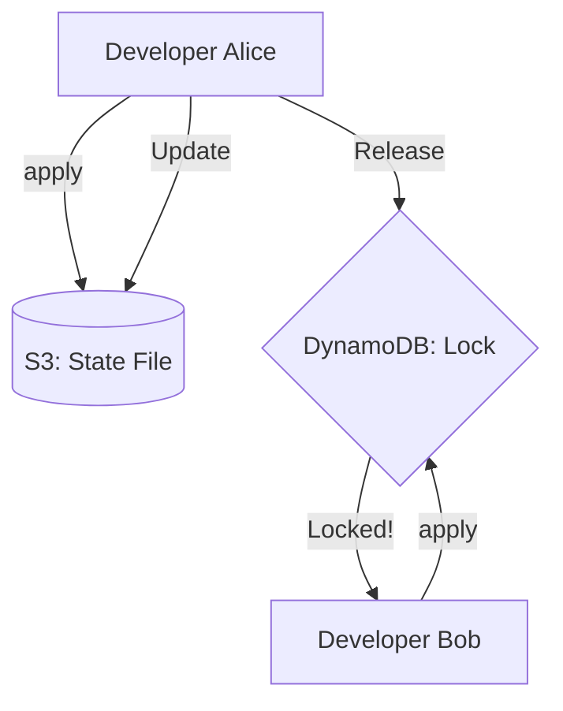

Version: 1.0.0
Last Updated: 2026-03-09
Prerequisites: Module 11.1 (Terraform Fundamentals)

## 1. Resources vs. Data Sources

### Story Introduction

Keep in mind **Building a House vs. Looking at the Neighborhood**.

1.  **Resources (Building)**: You say, "I want to build a swimming pool." You own it, you build it, and if you change your mind, you can demolish it. This is a `resource` block.
2.  **Data Sources (Looking)**: You say, "Where is the nearest fire hydrant?" You didn't build the hydrant, and you can't delete it. You just need to know its "Address" so you can connect your house's hose to it. This is a `data` block.

In Terraform, we use **Data Sources** to "look up" stuff that already exists in the cloud (like the ID of a specific VPC or the latest version of an Ubuntu image).

### Concept Explanation

#### Resources:
*   Things Terraform **manages**.
*   Terraform creates, updates, and deletes these.
*   Example: `resource "aws_s3_bucket" "my_data" {}`

#### Data Sources:
*   Things Terraform **reads**.
*   Terraform only fetches information about these; it doesn't touch them.
*   Example: `data "aws_vpc" "existing_vpc" { id = "vpc-12345" }`

---

## 2. Terraform State: The Cluster's Memory

### Concept Explanation

When you run `terraform apply`, Terraform creates a file called `terraform.tfstate`. This is the most important file in your project.

*   **What is it?**: A JSON file that maps your code to the real-world resources in the cloud. 
*   **Why is it needed?**: If you delete a resource from your code, Terraform looks at the State file to know *which* specific resource in AWS it needs to delete.

#### Remote State (Teamwork):
If you work in a team, you can't keep the state file on your laptop. If your coworker also runs Terraform, they won't know what you did!
*   **Solution**: Store the state file in a central place like **Amazon S3**.
*   **Locking**: Use **DynamoDB** to "Lock" the state. This prevents two people from running `terraform apply` at the same exact second and breaking the infrastructure.

### Code Example (Configuring Remote State)

```hcl
terraform {
  backend "s3" {
    bucket         = "my-company-terraform-state"
    key            = "dev/frontend/terraform.tfstate"
    region         = "us-east-1"
    dynamodb_table = "terraform-lock-table"
  }
}
```

### Step-by-Step Walkthrough

1.  **`backend "s3"`**: This tells Terraform, "Don't save the state file on my hard drive. Upload it to this S3 bucket."
2.  **`key`**: This is the "Folder Path" in S3. It helps you keep your "Dev" state separate from your "Production" state.
3.  **`dynamodb_table`**: When you start a `plan`, Terraform creates a record in this table. If your coworker tries to run a plan, Terraform will see the record and say "Error: State is currently locked by someone else."

### Diagram



### Real World Usage

In **Large Scale Migrations**, we use **Data Sources** to "import" existing infrastructure. Imagine a company has 500 servers built by hand. They don't want to delete them and start over. They write Terraform code to match the servers, use `data` or `terraform import` to link the code to the real servers, and then they can manage them safely with code from that day forward.

### Best Practices

1.  **NEVER commit `.tfstate` to Git**: State files contain sensitive data (like database passwords in plain text!). Always use a Remote Backend.
2.  **Enabled Versioning on S3**: If you accidentally break your state file, "S3 Versioning" allows you to restore a working version from 5 minutes ago.
3.  **One State per Environment**: Don't put your whole company in one state file. If you make a mistake, you could delete everything. Use separate state files for `networking`, `database`, and `application`.

### Common Mistakes

*   **Losing the State File**: If you delete your local state file and don't have a backup, Terraform will think all your servers are "Gone" and try to create 500 new ones!
*   **Manual Edits to JSON**: Opening `terraform.tfstate` in a text editor and changing things. This is the fastest way to break your infrastructure. Always use `terraform state` commands if you need to move things.
*   **Concurrent Runs**: Forgetting state locking and having two CI/CD pipelines try to update the same server at once.

### Exercises

1.  **Beginner**: What is the difference between a `resource` and a `data` block?
2.  **Intermediate**: What information is stored inside a `terraform.tfstate` file?
3.  **Advanced**: Why do we use DynamoDB alongside S3 for remote state?

### Mini Projects

#### Beginner: The Image Finder
**Task**: Use a `data` source to find the latest "Amazon Linux 2" AMI ID in your region.
**Deliverable**: The HCL code for the data source and a `resource` block that uses `data.aws_ami.latest.id`.

#### Intermediate: The S3 Backend Setup
**Task**: Create an S3 bucket and a DynamoDB table (with a Primary Key of `LockID`). Configure your Terraform project to use them as a backend.
**Deliverable**: Run `terraform init` and show that Terraform is now "Initializing the backend."

#### Advanced: The State Surgeon
**Task**: Research the command `kubectl state list` and `kubectl state show`.
**Deliverable**: Run these commands on a test project and explain what the "Attributes" of a resource look like in the state vs. what you wrote in the `.tf` file.
