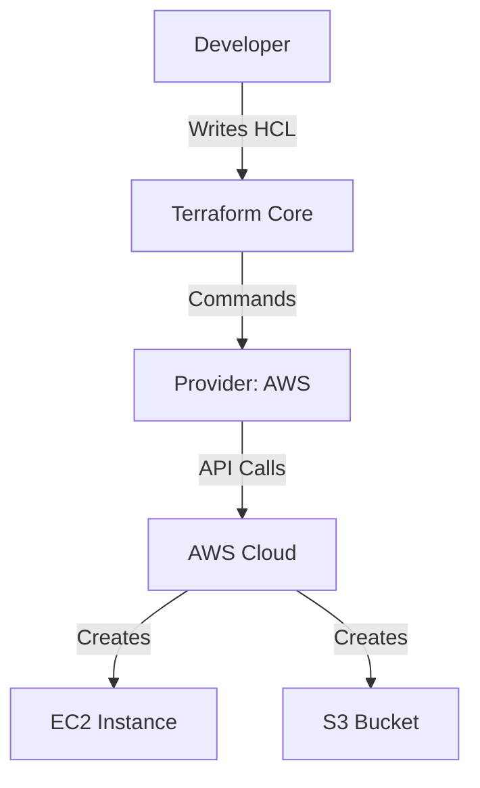

Version: 1.0.0
Last Updated: 2026-03-09
Prerequisites: Module 7 (AWS) & Module 6.1 (Cloud Concepts)

## 1. What is IaC? (Infrastructure as Code)

### Story Introduction

Imagine **Ordering a Custom Sandwich (The Subway Way)**.

1.  **Manual Method (The Old Way)**: You walk up to the counter and say "I want bread. Now put some ham. Now some cheese. Wait, not that much cheese!" You might forget the pickles. Your friend might order the exact same thing but get different bread because the employee was tired.
2.  **IaC Method (The Terraform Way)**: You write your order on a slip of paper (The Code) and hand it to a robot. The robot reads the paper and builds the *exact* same sandwich every single time. If you want 100 sandwiches, you just tell the robot to read the paper 100 times.

**Terraform** is that slip of paper. Instead of clicking buttons in the AWS Console, you write your infrastructure in a file.

### Concept Explanation

**Terraform** is an open-source tool created by HashiCorp that allows you to define and provide data center infrastructure using a high-level configuration language called **HCL** (HashiCorp Configuration Language).

#### The 4 Major Commands:
1.  **`terraform init`**: Prepares the workspace (downloads the AWS drivers).
2.  **`terraform plan`**: Shows you a preview. "If I run this, I will create 2 servers and 1 database."
3.  **`terraform apply`**: Does the actual work.
4.  **`terraform destroy`**: Deletes everything. (Use with caution!).

#### Key Features:
*   **Declarative**: You describe the *result* (e.g., "I want 5 servers"), not the steps (e.g., "Step 1: Buy server, Step 2: Install Linux...").
*   **Platform Agnostic**: You can use the same tool to manage AWS, Azure, Google Cloud, and even GitHub.

---

## 2. Providers and HCL Syntax

### Concept Explanation

Terraform doesn't know how to talk to AWS naturally. It needs a **Provider** (a Translator).
There are providers for almost everything: `aws`, `google`, `docker`, `kubernetes`, even `spotify`.

### Code Example (Your First Terraform File - `main.tf`)

```hcl
# 1. Define the Provider (Who are we talking to?)
provider "aws" {
  region = "us-east-1"
}

# 2. Define a Resource (What are we building?)
# FORMAT: resource "type" "local_name"
resource "aws_instance" "my_first_server" {
  ami           = "ami-0abcdef1234567890" # Ubuntu
  instance_type = "t2.micro"

  tags = {
    Name = "HelloWorldMachine"
  }
}
```

### Step-by-Step Walkthrough

1.  **`provider "aws"`**: This tells Terraform to download the AWS plugin.
2.  **`resource`**: This is the heart of Terraform. We are asking for an `aws_instance` (EC2).
3.  **`my_first_server`**: This is just a nickname *inside* Terraform. It's not the name on AWS.
4.  **`ami` and `instance_type`**: These are the "Arguments" (Details) of our order (Module 7.2).

### Diagram



### Real World Usage

In **Disaster Recovery**, Terraform is a miracle. Imagine a massive fire destroys an entire AWS region (e.g., `us-east-1`). If you built your infra manually, it would take weeks to remember all the settings and rebuild. If you use Terraform, you just change the region to `us-west-2` and run `terraform apply`. Your entire company's infrastructure is rebuilt in minutes in a safe region.

### Best Practices

1.  **Lock your Versions**: Always specify which version of the provider you are using. You don't want a random update to change how your servers are built!
2.  **Run `terraform fmt`**: This automatically fixes the spacing and indentation of your code to keep it clean.
3.  **Always use `terraform plan`**: Never run `apply` without looking at the plan first. It might show that Terraform is about to delete your main database because of a small typo!
4.  **Use a `.gitignore`**: Terraform creates local files (like `.terraform/` and `terraform.tfstate`) that should *never* be uploaded to Git.

### Common Mistakes

*   **Manual Changes (Configuration Drift)**: Changing the server's CPU in the AWS console manually. Terraform will see this, think the server is "broken," and try to change it back to what's in the code.
*   **Hardcoding Region**: Putting `us-east-1` in 10 different files. (Use Variables instead - Module 11.3).
*   **Forgetting to `init`**: Trying to run a plan before Terraform has downloaded the provider plugins.

### Exercises

1.  **Beginner**: What are the four main Terraform commands in order?
2.  **Intermediate**: What is the purpose of an "HCL" file?
3.  **Advanced**: Why is "Declarative" code better than "Imperative" code (like a Bash script) for managing infrastructure?

### Mini Projects

#### Beginner: The Terraform Intro
**Task**: Install Terraform. Create a file called `provider.tf` with the official AWS provider block. Run `terraform init`.
**Deliverable**: A screenshot of your terminal showing the message "Terraform has been successfully initialized!".

#### Intermediate: The S3 Creator
**Task**: Write a Terraform resource block to create an S3 bucket with a globally unique name. (Check Module 7.3 for naming rules).
**Deliverable**: Run `terraform plan` and show the output confirming that 1 resource will be created.

#### Advanced: The Cross-Resource Link
**Task**: Create an EC2 instance AND an Elastic IP (EIP) in Terraform. Link the EIP to the instance using its `id`.
**Deliverable**: The HCL code showing how you used the output of one resource as the input for another.
