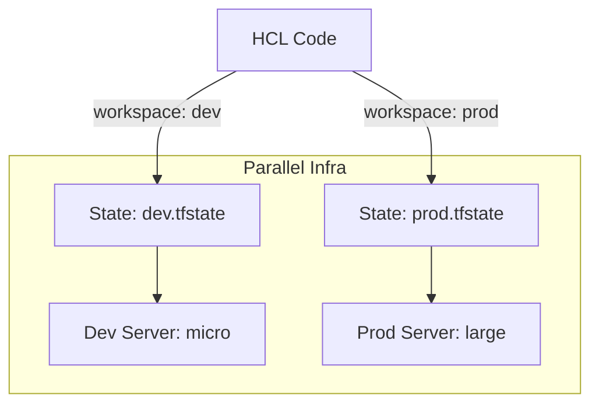

Version: 1.0.0
Last Updated: 2026-03-09
Prerequisites: Module 11.1 - 11.3

## 1. Terraform Workspaces: Multi-Environment Logic

### Story Introduction

Imagine **A Professional Kitchen with Multiple Zones**.

1.  **Prep Zone (Development)**: You are testing a new recipe. You use cheap ingredients and small pans. 
2.  **Service Zone (Production)**: You are cooking for real customers. You use the highest quality equipment and everything must be perfect.

**Terraform Workspaces** allow you to use the *same* kitchen (The Code) but keep the zones separate.
*   In the `dev` workspace, your code creates a tiny `t2.micro` server.
*   In the `prod` workspace, that *exact same* code creates a massive `m5.large` cluster.
*   The State files (Module 11.2) for each workspace are kept separate, so a mistake in the Prep Zone won't destroy the Service Zone.

### Concept Explanation

Workspaces allow you to manage multiple sets of infrastructure from a single configuration.

#### Common Commands:
*   **`terraform workspace new dev`**: Create a new environment.
*   **`terraform workspace select prod`**: Switch to your production environment.
*   **`terraform workspace list`**: See which "Zone" you are currently in.

---

## 2. Advanced Logic: Count, For_Each, and Provisioners

### Concept Explanation

Sometimes you need to create 10 identical buckets. You don't want to copy the same code 10 times.

1.  **`count`**: A simple loop. (`count = 5` creates 5 resources).
2.  **`for_each`**: A more powerful loop. Use this for maps and lists (e.g., "Create a bucket for each name in this list: ['images', 'logs', 'backups']").
3.  **Provisioners**: Commands that run *after* the infrastructure is created.
    *   **local-exec**: Runs a command on your laptop (e.g., "Add the new server's IP to my SSH config").
    *   **remote-exec**: Runs a command on the new server (e.g., "Install Nginx").
    *   **WARNING**: Provisioners are a "Last Resort." Use **Ansible** (Module 12) for server configuration instead!

### Code Example (The `for_each` Loop)

```hcl
# Create multiple IAM users using one block
resource "aws_iam_user" "team_members" {
  for_each = toset(["alice", "bob", "charlie"])
  name     = each.key

  tags = {
    Team = "DevOps"
  }
}
```

### Step-by-Step Walkthrough

1.  **`toset(["alice", ...])`**: This creates a unique list.
2.  **`each.key`**: Terraform loops through the list. In the first run, `each.key` is "alice." In the second, it is "bob."
3.  **Efficiency**: If you add "dave" to the list, Terraform will only create ONE new user. It won't touch alice or bob.
4.  **`terraform state list`**: You will see three resources: `aws_iam_user.team_members["alice"]`, `aws_iam_user.team_members["bob"]`, etc.

### Diagram



### Real World Usage

In **Auto-Scaling Architectures**, we use Workspaces to test our "Scaling Rules." We apply the rules in the `staging` workspace and simulate a traffic spike. If the servers scale correctly, we switch to the `prod` workspace and apply the exact same code, knowing it is safe.

### Best Practices

1.  **Use `for_each` over `count`**: If you delete the first item in a "count" list, Terraform might delete and recreate every single resource because the "index numbers" changed. `for_each` is much more stable.
2.  **Avoid Provisioners**: If your `remote-exec` script fails, Terraform still thinks the resource is "Finished." This leaves you with a "Broken" half-configured server. Use **Cloud-Init** or **Ansible**.
3.  **Lock your State**: Always ensure your remote backend (Module 11.2) is configured before using workspaces.
4.  **Use TFLint**: Use a "Linter" to check your code for errors and best practice violations before you even run `plan`.

### Common Mistakes

*   **Destroying the wrong workspace**: Thinking you are in `dev` but actually being in `prod` when you run `terraform destroy`. (Always check `terraform workspace show`!).
*   **Provisioner Overuse**: Trying to use Terraform to install 50 different apps on a server. Terraform is for **Infra**; Ansible/Docker is for **Apps**.
*   **Hardcoded passwords in logs**: If a provisioner fails, it might print its command (including the password) to the public terminal logs.

### Exercises

1.  **Beginner**: What is the command to create a new Terraform workspace?
2.  **Intermediate**: Why is `for_each` generally better than `count` for creating multiple resources?
3.  **Advanced**: What is the danger of using `remote-exec` to install software on a server?

### Mini Projects

#### Beginner: The Workspace Switcher
**Task**: Create two workspaces: `dev` and `test`. Switch between them.
**Deliverable**: Run `terraform workspace list` and show the asterisk (*) next to the `test` workspace.

#### Intermediate: The Loop Master
**Task**: Create a list of 3 bucket names. Use `for_each` to create all three S3 buckets in one block of code.
**Deliverable**: The HCL code and the output of `terraform plan` showing 3 resources to be added.

#### Advanced: The Local-Exec Auditor
**Task**: Create an EC2 instance. Use a `local-exec` provisioner to write the instance's Public IP to a local file called `server_ips.txt` as soon as it is created.
**Deliverable**: The HCL code for the `provisioner` block.
