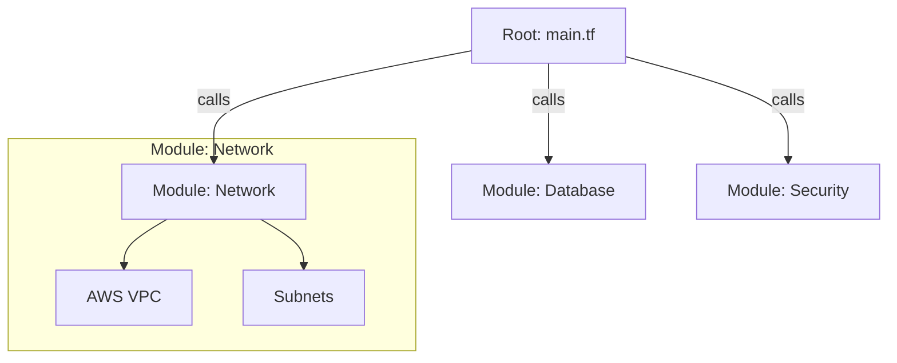

Version: 1.0.0
Last Updated: 2026-03-09
Prerequisites: Module 11.1 & 11.2

## 1. Variables and Outputs: The Input/Output Pins

### Story Introduction

Imagine **A Generic T-Shirt Factory**.

You have a single machine (Your Terraform Code) that knows how to make a shirt. 
*   **Without Variables**: You build a new machine every time you want a "Blue XL" shirt. If you want a "Red S" shirt, you throw the old machine away and build a new one. This is slow and wasteful.
*   **With Variables**: The machine has **Dials and Switches** on the side. 
    *   **Variables (Inputs)**: You turn the dial to "Red" and the switch to "S." The machine makes the correct shirt.
    *   **Outputs**: After the shirt is made, a screen shows you the "Serial Number" and "Final Weight."

Variables make your code reusable. Outputs give you the information you need *after* the work is done (like the IP address of your new server).

### Concept Explanation

#### Input Variables:
Allow you to customize your Terraform code without changing the source code.
```hcl
variable "instance_type" {
  description = "The type of EC2 instance to launch"
  type        = string
  default     = "t2.micro"
}
```

#### Output Values:
Print information to the terminal or share data with other modules.
```hcl
output "public_ip" {
  value = aws_instance.my_server.public_ip
}
```

---

## 2. Terraform Modules: Building with Legos

### Concept Explanation

As your infrastructure grows, you don't want to keep everything in one `main.tf` file (it becomes a 1,000-line "Spaghetti" file). You use **Modules**.

A **Module** is just a folder containing some `.tf` files.
*   **Root Module**: Your main project folder.
*   **Child Module**: A reusable "Package" (e.g., a "VPC Module" or a "Database Module").

Instead of writing 100 lines of code to build a secure network every time, you just "call" the network module and tell it how many subnets you want.

### Code Example (Calling a Module)

```hcl
# main.tf

# Using a module to create a network
module "my_vpc" {
  source = "./modules/network"

  vpc_name    = "production-vpc"
  cidr_block  = "10.0.0.0/16"
}

# Using a module to create a server inside that network
module "my_app_server" {
  source = "./modules/ec2"

  instance_name = "web-tier-01"
  subnet_id     = module.my_vpc.public_subnet_id # Using an output from the network module!
}
```

### Step-by-Step Walkthrough

1.  **`source`**: This tells Terraform where to find the "Blueprint." It could be a local folder or a GitHub URL.
2.  **Parameters**: `vpc_name` and `cidr_block` are variables inside the module. We are "Tuning the Dials" for this specific project.
3.  **Module Inter-connectivity**: Notice how the EC2 module uses `module.my_vpc.public_subnet_id`. This is the power of modules! You can pass the output of one "Lego block" as the input for another.
4.  **`terraform init`**: You MUST run this every time you add a new module. Terraform needs to "Connect" the modules together.

### Diagram



### Real World Usage

In **Large Cloud-Native Companies**, the "Central Platform Team" writes gold-standard modules (e.g., "The Perfect Secure S3 Bucket"). They publish these modules to a **Private Terraform Registry**. Other developers in the company don't have to learn all the complex S3 security settings; they just "use" the module. This ensures that every bucket in the whole company follows the same security rules.

### Best Practices

1.  **Use `.tfvars` files**: Keep your variable *definitions* in `variables.tf`, but put your actual *values* in `dev.tfvars` or `prod.tfvars`.
2.  **Always provide Descriptions**: Future you will forget what `variable "x"` does. Writing `description = "The port for the Load Balancer"` takes 5 seconds and saves hours of debugging.
3.  **Module Granularity**: Don't make modules too big (e.g., "MyWholeCloud" module). Keep them small and focused (e.g., "S3-Static-Site").
4.  **Use the Terraform Registry**: Before writing a complex module (like for a full Kubernetes cluster), check if a high-quality, verified module already exists on the official **Terraform Registry**.

### Common Mistakes

*   **Circular Dependencies**: Module A needs an output from Module B, but Module B needs an output from Module A. Terraform will panic!
*   **Hardcoded Subnet IDs**: Putting `subnet-12345` inside a module. This means you can never use that module in a different account or region.
*   **Version Drift**: Not locking the version of a module you are using from GitHub. If the module author changes their code, your infrastructure might break the next time you run `apply`.

### Exercises

1.  **Beginner**: What is the difference between an input variable and an output value?
2.  **Intermediate**: Why should you use modules instead of putting all your code in `main.tf`?
3.  **Advanced**: How do you pass the output of one module to the input of another module?

### Mini Projects

#### Beginner: The Variable Greeting
**Task**: Create a variable called `user_name`. Create an `output` that prints `"Hello, [user_name]"`. Run `terraform plan -var="user_name=Abhishek"`.
**Deliverable**: The terminal output showing your name in the "Changes to Outputs" section.

#### Intermediate: The Map Specialist
**Task**: Research the `map` variable type. Create a variable that maps an environment name (e.g., `dev` or `prod`) to an instance type (e.g., `t2.micro` or `t3.large`).
**Deliverable**: The HCL code for the variable and a resource block that uses a "lookup" based on the environment.

#### Advanced: The Module Creator
**Task**: Create a folder called `modules/s3-bucket`. Inside it, write code to create an S3 bucket and an output for the bucket's ARN. Call this module from your root `main.tf`.
**Deliverable**: The file structure and the `module` block used in `main.tf`.
