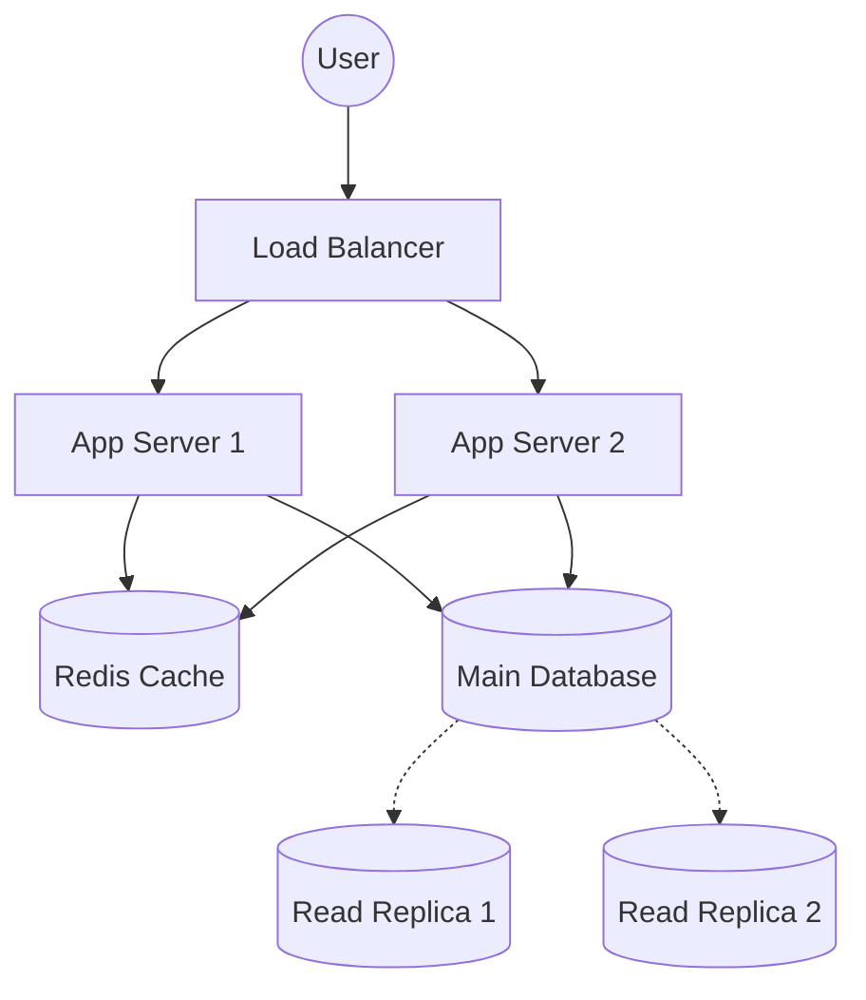

## The Story: The Expansion of "Pizza Palace"

Meet Mario, the proud owner of **Pizza Palace**, a small but beloved pizzeria in a quiet neighborhood. In the beginning, life was simple. Mario took orders, baked pizzas, and served them himself. 

### The Scaling Struggle
As word of mouth spread, Mario became overwhelmed. 
1. **The Single Point of Failure**: If Mario got sick, the shop closed.
2. **The Bottleneck**: Mario could only stretch so much dough at once.
3. **The Storage Crisis**: He couldn't fit enough cheese in his tiny fridge for the weekend rush.

To grow, Mario had to "design a system." He hired more chefs (**Replication**), bought a bigger fridge (**Vertical Scaling**), and eventually opened more branches (**Horizontal Scaling**). He even started keeping pre-made dough balls ready (**Caching**) and hired a receptionist to handle calls while he cooked (**Load Balancing**).

System Design is simply the art of moving from Mario's tiny shop to a global pizza empire without the whole thing collapsing.

---

## Core Concepts Explained

### 1. CAP Theorem
In a distributed system, you can only pick **two** out of three:
*   **Consistency (C)**: Every read receives the most recent write or an error.
*   **Availability (A)**: Every request receives a (non-error) response, without the guarantee that it contains the most recent write.
*   **Partition Tolerance (P)**: The system continues to operate despite an arbitrary number of messages being dropped by the network between nodes.

**The Reality**: In the real world, "P" is non-negotiable (networks fail). So you choose between **CP** (Consistency) or **AP** (Availability).

### 2. Caching Strategies
*   **Read-Through**: Cache is checked first. If miss, data is pulled from DB, stored in cache, and returned.
*   **Write-Through**: Data is written to cache and DB simultaneously.
*   **Write-Back**: Data is written to cache only; DB update happens later (faster but risky).

---

## System Visualization



---

## Code Examples: Caching Strategy (Read-Through)

### Python Implementation
```python
import time

class Database:
    def get_user(self, user_id):
        print(f"--- Fetching user {user_id} from Database ---")
        time.sleep(1) # Simulating heavy DB operation
        return {"id": user_id, "name": f"User_{user_id}"}

class Cache:
    def __init__(self):
        self.store = {}

    def get(self, key):
        return self.store.get(key)

    def set(self, key, value):
        self.store[key] = value

class UserService:
    def __init__(self, db, cache):
        self.db = db
        self.cache = cache

    def get_user_profile(self, user_id):
        # Read-Through Cache Logic
        cached_user = self.cache.get(user_id)
        if cached_user:
            print(f"--- Cache Hit for user {user_id} ---")
            return cached_user
        
        user = self.db.get_user(user_id)
        self.cache.set(user_id, user)
        return user

# Execution
db = Database()
cache = Cache()
service = UserService(db, cache)

print(service.get_user_profile(101)) # DB call
print(service.get_user_profile(101)) # Cache Hit
```

### Java Implementation
```java
import java.util.HashMap;
import java.util.Map;

class Database {
    public String getUser(int userId) {
        System.out.println("--- Fetching user " + userId + " from Database ---");
        try { Thread.sleep(1000); } catch (InterruptedException e) {}
        return "User_Data_" + userId;
    }
}

class Cache {
    private Map<Integer, String> store = new HashMap<>();

    public String get(int key) { return store.get(key); }
    public void set(int key, String value) { store.put(key, value); }
}

public class UserService {
    private Database db;
    private Cache cache;

    public UserService(Database db, Cache cache) {
        this.db = db;
        this.cache = cache;
    }

    public String getUserProfile(int userId) {
        String cachedData = cache.get(userId);
        if (cachedData != null) {
            System.out.println("--- Cache Hit for user " + userId + " ---");
            return cachedData;
        }

        String data = db.getUser(userId);
        cache.set(userId, data);
        return data;
    }

    public static void main(String[] args) {
        UserService service = new UserService(new Database(), new Cache());
        System.out.println(service.getUserProfile(101)); // DB Fetch
        System.out.println(service.getUserProfile(101)); // Cache Hit
    }
}
```

---

## Interview Q&A

### Q1: In the CAP theorem, why can't we have all three (C, A, and P)?
**Answer**: Imagine a network split (Partition) where Node A cannot talk to Node B. If a write happens on Node A:
*   To keep **Consistency**, Node B must refuse to serve requests until it's updated (losing **Availability**).
*   To keep **Availability**, Node B serves old data (losing **Consistency**).
The network partition (P) forces the trade-off.

### Q2: What is the downside of a Write-Back cache strategy?
**Answer**: While it offers the lowest write latency, it's risky. If the cache server crashes before the data is periodically flushed to the main database, those writes are permanently lost (**Data Loss risk**).

### Q3: How do you handle a "Database Hotspot" in a read-heavy system?
**Answer**: (Medium-Hard)
1. **Read Replicas**: Distribute read load across multiple secondary nodes.
2. **Aggressive Caching**: Use Redis/Memcached to serve the most frequent queries.
3. **Data Partitioning**: Shard the data so a single node doesn't carry the entire load.
4. **Rate Limiting**: Protect the DB from surge traffic.
