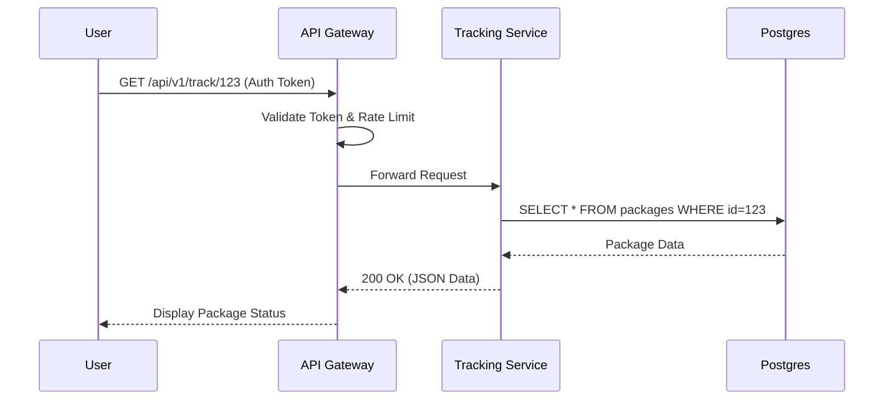

## The Story: The "QuickDeliver" Logistics App

Sarah is a lead engineer tasked with building **QuickDeliver**, a competitor to Fedex. Her manager says, "Just build a button where users can send packages."

### The Ambiguity Trap
If Sarah just starts coding, she'll hit a wall:
1. **Scope Creep**: Does it handle international shipping? Does it insure packages?
2. **The Capacity Catastrophe**: Is it for 100 users or 100 million?
3. **The API Mess**: How do partners track packages? Is the URL `/get-info` or `/api/v1/track/{id}`?

By gathering **Functional Requirements** (what it does) and **Non-Functional Requirements** (how it performs), and designing a **Standardized API**, Sarah ensures the foundation of QuickDeliver is solid.

---

## Core Concepts Explained

### 1. Functional vs Non-Functional Requirements
*   **Functional (FR)**: Features users interact with.
    *   *Example*: "User can track a package using a tracking ID."
*   **Non-Functional (NFR)**: The "ilities" (Scalability, Availability, Reliability).
    *   *Example*: "The system must handle 10,000 requests per second with < 200ms latency."

### 2. RESTful API Design Principles
*   **Nouns, not Verbs**: Use `/packages`, not `/getPackages`.
*   **HTTP Methods**:
    *   `GET`: Retrieve data.
    *   `POST`: Create data.
    *   `PUT`/`PATCH`: Update data.
    *   `DELETE`: Remove data.
*   **Versioning**: `/api/v1/resource` ensures backward compatibility.

---

## API Flow Visualization



---

## Code Examples: API Request Validation & Pagination

### Python Implementation (using a simplified Flask-like style)
```python
class PackageAPI:
    def __init__(self):
        # Mock database
        self.packages = [{"id": i, "status": "In Transit"} for i in range(1, 101)]

    def get_packages(self, page=1, limit=10):
        # 1. Validation
        if page < 1 or limit < 1:
            return {"error": "Invalid pagination parameters"}, 400
        
        # 2. Pagination Logic
        start = (page - 1) * limit
        end = start + limit
        
        sliced_data = self.packages[start:end]
        
        return {
            "page": page,
            "limit": limit,
            "total": len(self.packages),
            "data": sliced_data
        }, 200

# Execution
api = PackageAPI()
# Fetching page 2 with 5 items
response, status = api.get_packages(page=2, limit=5)
print(f"Status: {status}")
print(f"Data: {response}")
```

### Java Implementation
```java
import java.util.ArrayList;
import java.util.List;
import java.util.stream.Collectors;

class Package {
    int id;
    String status;
    Package(int id, String status) { this.id = id; this.status = status; }
}

public class PackageService {
    private List<Package> packageDb = new ArrayList<>();

    public PackageService() {
        for (int i = 1; i <= 100; i++) {
            packageDb.add(new Package(i, "Shipped"));
        }
    }

    public void getPackages(int page, int size) {
        // 1. Validation
        if (page < 1 || size < 1) {
            System.err.println("400 Bad Request: Invalid params");
            return;
        }

        // 2. Pagination Logic (Java Streams)
        int skip = (page - 1) * size;
        List<Package> result = packageDb.stream()
                .skip(skip)
                .limit(size)
                .collect(Collectors.toList());

        System.out.println("Page: " + page + " | Items: " + result.size());
        for (Package p : result) {
            System.out.println("ID: " + p.id + ", Status: " + p.status);
        }
    }

    public static void main(String[] args) {
        PackageService service = new PackageService();
        service.getPackages(3, 5); // Fetch Page 3, Size 5
    }
}
```

---

## Interview Q&A

### Q1: Why is API versioning important?
**Answer**: As your system evolves, you might need to change the data structure or logic. Versioning (e.g., `/v1/`, `/v2/`) allows old clients (like an old mobile app) to continue working without breaking while new clients can use the improved `/v2/` API.

### Q2: How do you gather requirements for a system like Twitter?
**Answer**: (Medium-Hard)
1. **Clarify the Actors**: Who uses it? (Celebrities, regular users, advertisers).
2. **FRs**: Posting a tweet, following users, viewing a timeline.
3. **NFRs**: Read-heavy (billions of reads vs millions of writes), high availability (tweets shouldn't disappear), low latency for timeline generation.
4. **Constraints**: Tweet size limit (280 chars), storage estimates for 10 years.

### Q3: What is the difference between `PUT` and `PATCH`?
**Answer**: 
*   `PUT` is used for **full updates**. You replace the entire resource with the payload.
*   `PATCH` is used for **partial updates**. You only send the fields that need to be changed.
