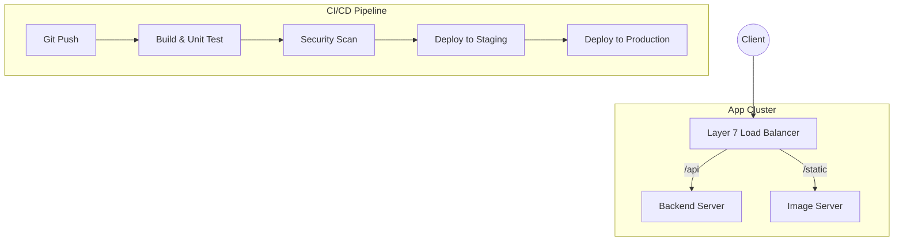

## The Story: The "Busiest Burger Joint" in Town

Benny owns **Benny's Burgers**. At first, Benny did everything. But soon, the line went out the door.

### The Crowd Problem
1. **The Doorman (Load Balancer)**: Benny hired a doorman to point customers to the least busy counter.
2. **The Layer 4 Doorman**: He just points people to a counter as soon as they walk in, without knowing what they want.
3. **The Layer 7 Doorman**: He asks, "Vegetarian or Meat?" then points them to the specific "Veg-Only" or "Meat-Only" chef.
4. **The Automatic Kitchen Upgrade (CI/CD)**: Whenever Benny invents a new burger recipe, he doesn't shut down the shop. He has a conveyor belt system that slowly replaces old ingredients with new ones while the kitchen is still running.

Load Balancing ensures no single server is crushed, while CI/CD ensures code gets from a developer's laptop to production safely and automatically.

---

## Core Concepts Explained

### 1. Load Balancing: Layer 4 vs Layer 7
*   **Layer 4 (Transport Layer)**: Decisions based on IP address and TCP/UDP ports. It's fast but "blind" to the actual content (like the URL or headers).
*   **Layer 7 (Application Layer)**: Decisions based on content (HTTP headers, Cookies, URL paths). It allows for **path-based routing** (e.g., `/images` goes to an image server).

### 2. CI/CD Pipeline Flow
*   **Continuous Integration (CI)**: Automatically build and test code whenever a developer pushes to the repository.
*   **Continuous Deployment (CD)**: Automatically deploy the code to production if it passes all tests.

---

## System Visualization: Load Balancing & CI/CD



---

## Code Examples: Round Robin Load Balancer Logic

### Python Implementation
```python
class LoadBalancer:
    def __init__(self, servers):
        self.servers = servers
        self.current = 0

    def get_server(self):
        if not self.servers:
            return None
        
        # Round Robin Logic
        server = self.servers[self.current]
        print(f"--- Routing request to: {server} ---")
        self.current = (self.current + 1) % len(self.servers)
        return server

# Execution
servers = ["Server_A (192.168.1.1)", "Server_B (192.168.1.2)", "Server_C (192.168.1.3)"]
lb = LoadBalancer(servers)

for i in range(5):
    lb.get_server()
```

### Java Implementation
```java
import java.util.Arrays;
import java.util.List;
import java.util.concurrent.atomic.AtomicInteger;

public class LoadBalancer {
    private final List<String> servers;
    private final AtomicInteger counter = new AtomicInteger(0);

    public LoadBalancer(List<String> servers) {
        this.servers = servers;
    }

    public String getNextServer() {
        if (servers.isEmpty()) return null;
        
        // Atomic increment and modulo for thread-safe Round Robin
        int index = counter.getAndIncrement() % servers.size();
        String server = servers.get(Math.abs(index));
        System.out.println("--- Routing request to: " + server + " ---");
        return server;
    }

    public static void main(String[] args) {
        List<String> servers = Arrays.asList("Server_A", "Server_B", "Server_C");
        LoadBalancer lb = new LoadBalancer(servers);

        for (int i = 0; i < 5; i++) {
            lb.getNextServer();
        }
    }
}
```

---

## Interview Q&A

### Q1: What is a "Secondary" or "Reverse Proxy"?
**Answer**: A reverse proxy (like Nginx) sits in front of web servers and forwards client requests to those servers. It's used for load balancing, SSL termination (handling HTTPS), and caching static content to reduce load on the application servers.

### Q2: Explain "Blue-Green Deployment" in CI/CD.
**Answer**: (Medium-Hard)
You have two identical production environments: **Blue** (currently live) and **Green** (idle). You deploy the new version to Green. Once it passes tests, you switch the Load Balancer to point to Green. If anything goes wrong, you switch back to Blue immediately. This ensures **zero-downtime** deployments.

### Q3: How do you handle a "Database Hotspot" in a read-heavy system?
**Answer**: (Medium-Hard)
1. **Read Replicas**: Distribute read load across multiple secondary nodes.
2. **Aggressive Caching**: Use Redis/Memcached to serve the most frequent queries.
3. **Data Partitioning**: Shard the data so a single node doesn't carry the entire load.
4. **Rate Limiting**: Protect the DB from surge traffic.

### Q4: How does a Load Balancer know if a server is dead?
**Answer**: It uses **Health Checks**. The load balancer periodically sends a "ping" or a specific HTTP request (like `GET /health`) to each server. If a server fails to respond within a timeout or returns an error code multiple times, it's marked as "unhealthy" and removed from the rotation.
---
