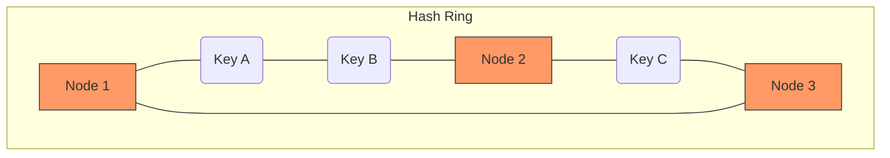

## The Story: The "Global Postal Service"

The **Global Postal Service (GPS)** had a problem. They had billions of letters but only one giant sorting machine.

### The Sorting Chaos
1. **The Partitioning**: They decided to split letters by continent (**Horizontal Partitioning**).
2. **The "Consistent Hashing" Trick**: When a new sorting center opened, they didn't want to reshuffle every single letter. They used a "Circular Map" where each letter just moved to the next closest center (**Consistent Hashing**).
3. **The Consistency Quarrel**: 
    *   **Strong Consistency**: Mom in London must see the exact same letter status as Dad in New York *instantly*. This makes the system slow because everyone has to wait for the update to sync.
    *   **Eventual Consistency**: It's okay if Dad sees "In Transit" for 2 seconds while Mom sees "Delivered." It's faster, and they'll both eventually agree.

Data Partitioning keeps the system manageable, while Consistency models define how we handle truth across multiple nodes.

---

## Core Concepts Explained

### 1. Consistent Hashing
In a traditional hash `H(key) % N`, if you add one node (N+1), nearly every key maps to a new node. **Consistent Hashing** maps keys and nodes to a circle. Adding a node only requires moving keys from one neighbor, minimizing data migration.

### 2. Consistency Models
*   **Strong Consistency**: After a write, any subsequent read will return that value. (Good for Banking).
*   **Eventual Consistency**: If no new updates are made, all reads will eventually return the last updated value. (Good for Social Media).

---

## Consistent Hashing Visualization



---

## Code Examples: Consistent Hashing Logic

### Python Implementation
```python
import hashlib

class ConsistentHash:
    def __init__(self, nodes=None):
        self.ring = {}
        self.sorted_keys = []
        if nodes:
            for node in nodes:
                self.add_node(node)

    def add_node(self, node):
        h = self._hash(node)
        self.ring[h] = node
        self.sorted_keys.append(h)
        self.sorted_keys.sort()
        print(f"--- Added Node: {node} at hash {h} ---")

    def get_node(self, key):
        if not self.ring: return None
        h = self._hash(key)
        # Find the first node clockwise
        for node_hash in self.sorted_keys:
            if h <= node_hash:
                return self.ring[node_hash]
        return self.ring[self.sorted_keys[0]]

    def _hash(self, val):
        return int(hashlib.md5(val.encode()).hexdigest(), 16) % 1000

# Execution
ch = ConsistentHash(["Node_A", "Node_B", "Node_C"])
print(f"Key 'User123' maps to: {ch.get_node('User123')}")
print(f"Key 'Order456' maps to: {ch.get_node('Order456')}")
```

### Java Implementation
```java
import java.util.SortedMap;
import java.util.TreeMap;

public class ConsistentHasher {
    private final SortedMap<Integer, String> ring = new TreeMap<>();

    public void addNode(String node) {
        int hash = node.hashCode();
        ring.put(hash, node);
        System.out.println("--- Added Node: " + node + " (Hash: " + hash + ") ---");
    }

    public String getNode(String key) {
        if (ring.isEmpty()) return null;
        int hash = key.hashCode();
        
        // Find the tail map (nodes with hash >= key's hash)
        SortedMap<Integer, String> tailMap = ring.tailMap(hash);
        int nodeHash = tailMap.isEmpty() ? ring.firstKey() : tailMap.firstKey();
        
        return ring.get(nodeHash);
    }

    public static void main(String[] args) {
        ConsistentHasher ch = new ConsistentHasher();
        ch.addNode("Server_Alpha");
        ch.addNode("Server_Beta");
        
        System.out.println("Routing 'my_data' to: " + ch.getNode("my_data"));
    }
}
```

---

## Interview Q&A

### Q1: What is the "Quorum" in distributed systems?
**Answer**: A quorum is the minimum number of nodes that must agree on an operation for it to be successful. 
*   **W + R > N** (where W=write nodes, R=read nodes, N=total replicas) ensures strong consistency because the set of write nodes and read nodes will always overlap.

### Q2: What is "Gossip Protocol"?
**Answer**: (Medium-Hard)
It's a peer-to-peer communication mechanism where nodes periodically share information about themselves and other nodes they know about. Like an office rumor, information eventually spreads to the entire cluster. It's used for **Failure Detection** and cluster membership in systems like Cassandra.

### Q3: Why is "Eventual Consistency" preferred for highly available systems?
**Answer**: Because it doesn't require a "global lock." Nodes can continue to accept writes even if some nodes are down or the network is slow. This follows the **AP** (Availability + Partition Tolerance) side of the CAP theorem, which is essential for global-scale services like Amazon or Facebook.
---
