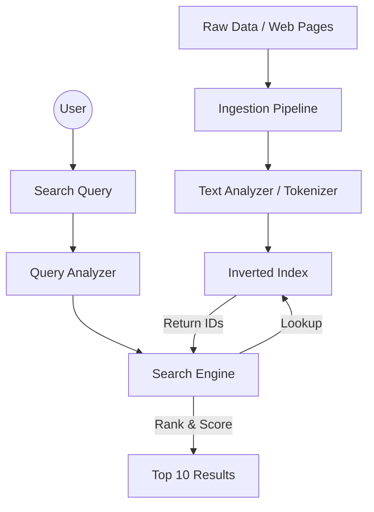

## The Story: The "Detective's Notebook"

Detective Dan is investigating a giant library of 1 million files. He's looking for every file that mentions "Secret Code."

### The Search Struggle
1. **The Brute Force (Grepping)**: Dan reads every file one by one. By file #10,000, he's exhausted. This is what happens when you search a database column without an **Index**.
2. **The Inverted Index**: Dan creates a notebook where he lists every unique word. Next to the word "Secret," he writes the ID of every file where it appears. 
    *   *Notebook*: `Secret` -> [File 42, File 108, File 999]
3. **The Tokenizer**: Dan realizes users might search for "Secrets" or "SECRET." He decides to lowercase everything and strip punctuation (**Text Analysis**).
4. **The Ranking**: If 100 files mention "Pizza," which one should Dan show first? He counts how many times "Pizza" appears in each file (**TF-IDF / Relevance Scoring**).

Search systems use specialized data structures to find needles in digital haystacks in milliseconds.

---

## Core Concepts Explained

### 1. Inverted Index
The heart of search engines (like Elasticsearch). Instead of mapping `Document -> Words`, it maps `Word -> List of Documents`.

### 2. Text Analysis Pipeline
1. **Character Filtering**: Removing HTML tags.
2. **Tokenization**: Splitting text into words.
3. **Token Filtering**: Lowercasing, removing "stop words" (the, is, at), and **Stemming** (turning "running" into "run").

---

## Search Engine Visualization



---

## Code Examples: Simple Inverted Index

### Python Implementation
```python
import collections

class SearchEngine:
    def __init__(self):
        self.index = collections.defaultdict(set)
        self.documents = {}

    def add_document(self, doc_id, text):
        self.documents[doc_id] = text
        # Tokenization & Lowercasing
        tokens = text.lower().split()
        for token in tokens:
            self.index[token].add(doc_id)
        print(f"--- Indexed Document {doc_id} ---")

    def search(self, query):
        query = query.lower()
        if query in self.index:
            doc_ids = self.index[query]
            return [self.documents[did] for did in doc_ids]
        return []

# Execution
engine = SearchEngine()
engine.add_document(1, "System Design is great")
engine.add_document(2, "Design patterns are useful")
engine.add_document(3, "Learning System architecture")

print(f"Search 'Design': {engine.search('Design')}")
```

### Java Implementation
```java
import java.util.*;

public class SimpleSearchIndex {
    private Map<String, List<Integer>> invertedIndex = new HashMap<>();
    private Map<Integer, String> docStore = new HashMap<>();

    public void indexDoc(int id, String text) {
        docStore.put(id, text);
        String[] tokens = text.toLowerCase().split("\\W+");
        for (String token : tokens) {
            invertedIndex.computeIfAbsent(token, k -> new ArrayList<>()).add(id);
        }
    }

    public List<String> search(String query) {
        List<Integer> ids = invertedIndex.getOrDefault(query.toLowerCase(), Collections.emptyList());
        List<String> results = new ArrayList<>();
        for (int id : ids) results.add(docStore.get(id));
        return results;
    }

    public static void main(String[] args) {
        SimpleSearchIndex engine = new SimpleSearchIndex();
        engine.indexDoc(1, "The quick brown fox");
        engine.indexDoc(2, "The lazy dog brown");

        System.out.println("Search 'brown': " + engine.search("brown"));
    }
}
```

---

## Interview Q&A

### Q1: What is "Fuzzy Search"?
**Answer**: Fuzzy search allows for finding results even if the search term is misspelled (e.g., searching for "Gooogle" still finds "Google"). It usually uses algorithms like **Levenshtein Distance** to calculate how many character changes are needed to turn one word into another.

### Q2: How does Elasticsearch handle giant datasets?
**Answer**: (Medium-Hard)
Elasticsearch uses **Sharding**. A large index is split into multiple "shards," and each shard is a self-contained Lucene index. These shards are distributed across the cluster. When a user searches, the query is sent to all shards, and the results are merged and ranked before being sent back to the user.

### Q3: What is "TF-IDF"?
**Answer**: It stands for **Term Frequency - Inverse Document Frequency**.
*   **TF**: How often a word appears in a document (more frequent = more relevant).
*   **IDF**: How rare a word is across the *entire* collection (rarer words like "System" are more important than common words like "the").
The product of the two gives a score used to rank search results.
---
