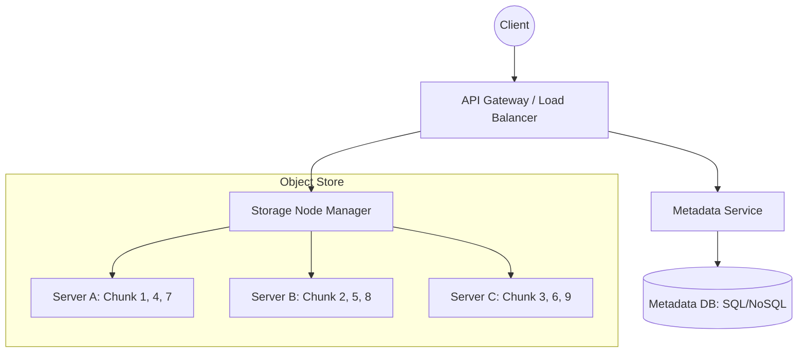

## The Story: The "Mega-Warehouse" of Memories

Alice runs **MemoryLink**, a service where people store their high-res photos and videos. 

### The Storage Explosion
1. **The Single Hard Drive Problem**: Alice started with one server. It filled up in a day. She needed a way to store "objects" (files) across thousands of machines.
2. **The "Chunk" Strategy**: When Bob uploads a 4GB video, Alice's system doesn't try to fit it on one disk. It chops the video into small 64MB "chunks" (**Data Chunking**) and spreads them across different servers.
3. **The Brain (Metadata DB)**: To find the video again, Alice keeps a master list: "Bob's Video -> [Chunk 1 on Server A, Chunk 2 on Server B, Chunk 3 on Server C]" (**Metadata Management**).
4. **The "No-Duplicates" Rule**: Dave uploads the same 4GB video. Instead of wasting 4GB, Alice's system realizes it already has those chunks and just gives Dave a link to the existing ones (**Deduplication**).

Distributed Storage (like AWS S3 or HDFS) allows us to store exabytes of data reliably by treating individual servers as disposable bricks.

---

## Core Concepts Explained

### 1. Object Storage vs Block Storage
*   **Object Storage (S3)**: Files are stored as "objects" with a key and metadata. Great for unstructured data (images, videos). Not for database files or OS boot disks.
*   **Block Storage (EBS)**: Files are stored as blocks of data. Great for databases because you can change just one piece of the file without re-uploading the whole thing.

### 2. Multi-Part Uploads
For large files, sending the whole file in one HTTP request is risky. If the connection drops at 99%, you start over. **Multi-Part Upload** allows uploading chunks independently and merging them at the end.

---

## Distributed Storage Visualization



---

## Code Examples: Simple File Chunking Strategy

### Python Implementation
```python
import hashlib
import os

class StorageNode:
    def __init__(self, name):
        self.name = name
        self.store = {}

    def save_chunk(self, chunk_id, data):
        self.store[chunk_id] = data
        print(f"--- [Node {self.name}] Saved Chunk: {chunk_id} ---")

class DistributedStorageManager:
    def __init__(self, nodes):
        self.nodes = nodes
        self.metadata = {}

    def upload_file(self, filename, content, chunk_size=4):
        print(f"--- Uploading {filename} ---")
        chunks = [content[i:i+chunk_size] for i in range(0, len(content), chunk_size)]
        
        file_mapping = []
        for i, chunk in enumerate(chunks):
            chunk_hash = hashlib.md5(chunk.encode()).hexdigest()
            # Determine node using simple modulo
            node_idx = i % len(self.nodes)
            self.nodes[node_idx].save_chunk(chunk_hash, chunk)
            file_mapping.append(chunk_hash)
            
        self.metadata[filename] = file_mapping

# Execution
nodes = [StorageNode("A"), StorageNode("B")]
manager = DistributedStorageManager(nodes)
manager.upload_file("vacation.txt", "This is a long text that will be chunked.")
```

### Java Implementation
```java
import java.util.*;

class ChunkNode {
    String id;
    Map<String, String> data = new HashMap<>();
    ChunkNode(String id) { this.id = id; }
    void persist(String hash, String content) {
        data.put(hash, content);
        System.out.println("--- [Node " + id + "] Persisted Chunk: " + hash + " ---");
    }
}

public class ObjectStore {
    private List<ChunkNode> nodes = new ArrayList<>();
    private Map<String, List<String>> metadata = new HashMap<>();

    public ObjectStore() {
        nodes.add(new ChunkNode("STORAGE_01"));
        nodes.add(new ChunkNode("STORAGE_02"));
    }

    public void upload(String fileName, String content) {
        List<String> chunkHashes = new ArrayList<>();
        // Split content every 5 characters (simulating chunks)
        for (int i = 0; i < content.length(); i += 5) {
            String chunk = content.substring(i, Math.min(i + 5, content.length()));
            String hash = "H_" + chunk.hashCode();
            int nodeIdx = (i / 5) % nodes.size();
            nodes.get(nodeIdx).persist(hash, chunk);
            chunkHashes.add(hash);
        }
        metadata.put(fileName, chunkHashes);
    }

    public static void main(String[] args) {
        ObjectStore store = new ObjectStore();
        store.upload("report.pdf", "HelloThisIsALargeFilePayload");
    }
}
```

---

## Interview Q&A

### Q1: What is "Erasure Coding"?
**Answer**: It's a method of data protection that's more efficient than simple replication. Instead of keeping 3 copies of a file (300% overhead), a file is split into `k` data chunks and `m` parity chunks. If any `m` chunks are lost, the original data can be mathematically reconstructed. It's used in S3 to achieve 99.999999999% durability with much lower storage cost.

### Q2: How do you handle file versioning in a distributed storage system?
**Answer**: (Medium-Hard)
Instead of overwriting the original file, ogni update is stored as a new object with a unique version ID. The metadata database tracks the "Current Version pointer" for the file. This allows users to "roll back" to an older state and protects against accidental deletions.

### Q3: Why is the Metadata Database often a bottleneck and how do you fix it?
**Answer**: Every time a file is read, the system must first query the metadata DB to find out where the chunks are. If you have trillions of files, this DB becomes huge and slow.
**Fixes**:
1. **Sharding**: Split metadata by File ID or User ID.
2. **In-Memory Caching (Redis)**: Keep hot metadata in memory.
3. **NoSQL**: Use highly scalable key-value stores (like Cassandra) instead of a traditional relational DB.
---
