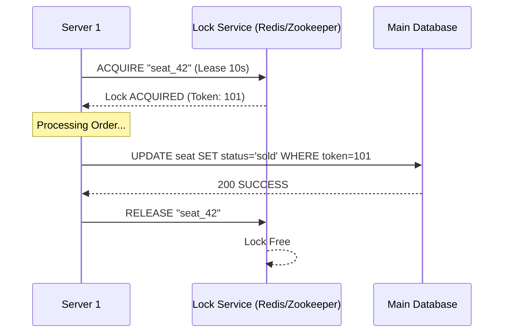

## The Story: The "Ticket Booth" Tussle

Two friends, Tom and Jerry, both try to buy the **very last seat** for a concert at the exact same millisecond using two different servers.

### The Double-Booking Disaster
1. **The Conflict**: Without coordination, Server A sees the seat is free and sells it to Tom. Server B also sees the seat is free and sells it to Jerry. Now we have two people for one seat!
2. **The "Talking Stick" (Distributed Lock)**: To fix this, we need a "Talking Stick." Before any server can sell a seat, it must "hold the stick."
3. **The Lease (Timeout)**: What if Server A grabs the stick and then crashes? The stick is stuck forever! Alice (the system) adds a timer (**Lease**). If Server A doesn't return the stick in 10 seconds, it's forcibly taken away.
4. **The Fencing Token**: To prevent the "Zombie Server" problem (a slow server waking up after its lease expired), we give every stick holder a unique, increasing number (**Fencing Token**). The Database only accepts the highest number it has seen.

Distributed Locks ensure that in a sea of thousands of servers, only one is performing a critical action at any given time.

---

## Core Concepts Explained

### 1. Lease-based Locking
Instead of a permanent lock, a client is granted a lock for a specific duration (e.g., 30 seconds). The client must periodically "renew" the lease if it's still working.

### 2. Distributed Coordination Systems
Dedicated systems like **Apache Zookeeper** or **etcd** are used to manage these locks. They are designed to be highly available and consistent (using consensus algorithms).

---

## Distributed Lock Visualization



---

## Code Examples: Simple Distributed Lock (Redis-style)

### Python Implementation
```python
import time

class SimpleDistributedLock:
    def __init__(self):
        self.lock_store = {} # Simulating Redis

    def acquire_lock(self, resource_id, client_id, lease_time):
        current_time = time.time()
        # If lock doesn't exist or has expired
        if resource_id not in self.lock_store or self.lock_store[resource_id]['expiry'] < current_time:
            self.lock_store[resource_id] = {
                'owner': client_id,
                'expiry': current_time + lease_time
            }
            print(f"--- [Client {client_id}] ACQUIRED Lock for {resource_id} ---")
            return True
        return False

    def release_lock(self, resource_id, client_id):
        if resource_id in self.lock_store and self.lock_store[resource_id]['owner'] == client_id:
            del self.lock_store[resource_id]
            print(f"--- [Client {client_id}] RELEASED Lock for {resource_id} ---")

# Execution
locker = SimpleDistributedLock()
locker.acquire_lock("seat_1", "App_Server_A", 2) # Success
locker.acquire_lock("seat_1", "App_Server_B", 2) # Fails
time.sleep(3)
locker.acquire_lock("seat_1", "App_Server_B", 2) # Success after timeout
```

### Java Implementation
```java
import java.util.concurrent.ConcurrentHashMap;

class LockMetadata {
    String owner;
    long expiry;
    LockMetadata(String owner, long expiry) { this.owner = owner; this.expiry = expiry; }
}

public class RedundantLockManager {
    private ConcurrentHashMap<String, LockMetadata> locks = new ConcurrentHashMap<>();

    public boolean lock(String resourceId, String clientId, int ttlMillis) {
        long now = System.currentTimeMillis();
        LockMetadata current = locks.get(resourceId);

        if (current == null || now > current.expiry) {
            locks.put(resourceId, new LockMetadata(clientId, now + ttlMillis));
            System.out.println("--- Lock ACQUIRED by " + clientId + " ---");
            return true;
        }
        System.out.println("--- Lock DENIED to " + clientId + " (Already held) ---");
        return false;
    }

    public static void main(String[] args) {
        RedundantLockManager manager = new RedundantLockManager();
        manager.lock("config_file", "Node_1", 1000);
        manager.lock("config_file", "Node_2", 1000); // Should fail
    }
}
```

---

## Interview Q&A

### Q1: What is "Redlock"?
**Answer**: Redlock is an algorithm proposed by the creators of Redis for distributed locking. It involves acquiring a lock from $N$ independent Redis nodes (usually 5). A client is considered to have the lock if it acquires it from a majority ($N/2+1$) of nodes within a specific timeframe.

### Q2: Why is the "Fencing Token" necessary? 
**Answer**: (Medium-Hard)
Consider a server that acquires a lock, but then experiences a "Stop-the-world" GC pause long enough for its lease to expire. The Lock Service gives the lock to another server. When the first server wakes up, it doesn't know its lease expired and tries to write to the DB. A fencing token (an incrementing ID) prevents this: the DB only accepts writes with a token greater than the last one it processed.

### Q3: What is the difference between Zookeeper and Redis for locking?
**Answer**: 
*   **Redis**: Faster, but uses an "Eventual Consistency" model (unless using Redlock). Great for high-performance locking where a rare double-acquisition is acceptable.
*   **Zookeeper**: Slower but provides **Strong Consistency** and "Ephemeral Nodes" (locks that automatically disappear if the client disconnects). Great for critical coordination where correctness is paramount.
---
