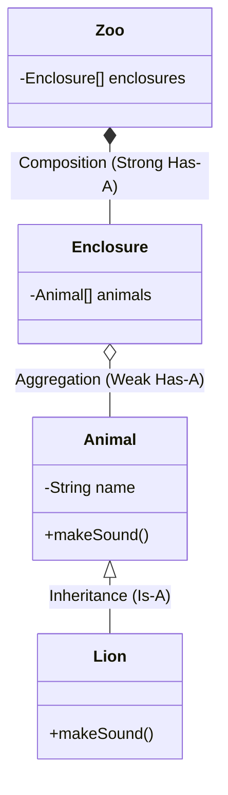

## The Story: The "Digital Zoo" Project

Zookeeper Zoe is building a digital simulator for her zoo. She needs to represent animals, enclosures, and visitors.

### The Blueprint Phase
1. **The Abstract Animal (Abstraction)**: Zoe realizes all animals eat and sleep, but she doesn't want to create a generic "Animal" object. She focuses on the essential behaviors (**Abstraction**).
2. **The Penguin Secret (Encapsulation)**: A Penguin's internal temperature is private. Only the Penguin's body can adjust it. Visitors can't just reach in and change it (**Private Modifiers**).
3. **The Multi-Talented Bird (Polymorphism)**: When Zoe says "Make a Sound," the Lion roars, and the Parrot speaks. One command, many forms (**Polymorphism**).
4. **The "Contains" vs "Is-A" (Composition vs Inheritance)**:
    *   A Lion **IS-A** Mammal (**Inheritance**).
    *   A Zoo **HAS-AN** Enclosure (**Composition**). If the Zoo is destroyed, the Enclosure is gone too.

OOP and UML are the blueprints and building blocks of software architecture, allowing us to model complex real-world systems into code.

---

## Core Concepts Explained

### 1. The 4 Pillars of OOP
*   **Encapsulation**: Bundling data and methods that work on that data, restricting direct access (using `private`).
*   **Abstraction**: Hiding internal complexity and showing only necessary functionality.
*   **Inheritance**: Deriving new classes from existing ones.
*   **Polymorphism**: Ability of a variable/function to take multiple forms (Method Overloading & Overriding).

### 2. Relationships: Composition vs Aggregation
*   **Composition**: Strong "Part-of" relationship. The life of the part depends on the whole (e.g., Human and Heart).
*   **Aggregation**: Weak "Has-a" relationship. The part can exist independently (e.g., Department and Teacher).

---

## UML Class Diagram Visualization



---

## Code Examples: Encapsulation & Polymorphism

### Python Implementation
```python
from abc import ABC, abstractmethod

class Animal(ABC):
    def __init__(self, name):
        self._name = name # Protected member

    @abstractmethod
    def make_sound(self):
        pass

class Lion(Animal):
    def make_sound(self):
        return f"{self._name} roars!"

class RobotAnimal(Animal):
    def make_sound(self):
        return "Bleep Bloop!"

def zoo_concert(animals):
    for animal in animals:
        print(animal.make_sound())

# Execution
simba = Lion("Simba")
r2d2 = RobotAnimal("RoboCat")
zoo_concert([simba, r2d2]) # Polymorphism in action
```

### Java Implementation
```java
abstract class Animal {
    private String name; // Encapsulation: Private data

    public Animal(String name) { this.name = name; }
    public String getName() { return name; }

    public abstract void makeSound();
}

class Dog extends Animal {
    public Dog(String name) { super(name); }
    
    @Override
    public void makeSound() {
        System.out.println(getName() + " says: Woof!");
    }
}

public class ZooSimulator {
    public static void main(String[] args) {
        Animal myDog = new Dog("Buddy");
        myDog.makeSound(); // Abstract method called on concrete instance
    }
}
```

---

## Interview Q&A

### Q1: What is the difference between an Interface and an Abstract Class?
**Answer**: 
*   **Abstract Class**: Can have state (fields) and concrete methods. It's for an "Is-A" relationship (e.g., `Dog` is a `Mammal`).
*   **Interface**: Describes a "Contract" or capability. It's for a "Can-Do" relationship (e.g., `Dog` `isRunnable`). A class can implement multiple interfaces but inherit from only one abstract class.

### Q2: Why prefer Composition over Inheritance?
**Answer**: (Medium-Hard)
Inheritance is "Tight Coupling." If you change the parent, all children might break. It's also inflexible (you can't change your parent at runtime). **Composition** is "Loose Coupling." You can swap internal components easily, making the system more modular and testable.

### Q3: What is "Method Overloading" vs "Method Overriding"?
**Answer**: 
*   **Overloading**: Same method name, different parameters in the **same class** (Compile-time polymorphism).
*   **Overriding**: Same method name and parameters in a **child class** (Runtime polymorphism).
---
