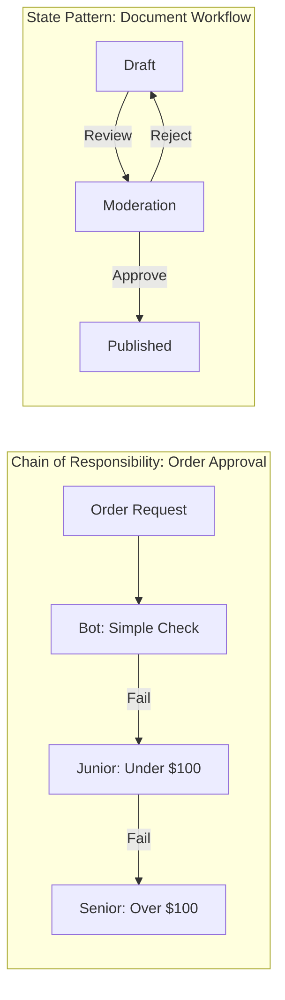

## The Story: The "Self-Service Kiosk"

Maya is building a self-service kiosk for a cinema. The kiosk has many different modes.

### The Problematic Flow
1. **The Vending Machine (State)**: A kiosk can be in `Idle`, `SelectingMovie`, `ProcessingPayment`, or `DispensingTickets`. Maya doesn't want localized `if (status == ...)` scattered everywhere. She creates specialized "State Classes." When you insert a card, the kiosk's "State" object simply swaps from `Idle` to `Processing` (**State Pattern**).
2. **The Complaint Hotline (Chain of Responsibility)**: A customer has a problem. 
    *   First, the **Automated Bot** tries to help. 
    *   If it can't, it passes the call to a **Junior Agent**. 
    *   If they can't help, it's passed to the **Manager**.
    Each person in the chain either handles the request or passes it to the next link (**Chain of Responsibility Pattern**).

Behavioral patterns like these handle **complex workflows** and **variable states**, preventing your code from becoming a massive "spaghetti" of conditions.

---

## Core Concepts Explained

### 1. State Pattern
Lets an object alter its behavior when its internal state changes. The object will appear to change its class.
*   **Context**: The class that has the state.
*   **State Interface**: Common interface for all concrete states.

### 2. Chain of Responsibility
Passes a request along a chain of handlers. Upon receiving a request, each handler decides either to process the request or to pass it to the next handler in the chain.

---

## Workflow Visualization



---

## Code Examples: State & Chain of Responsibility

### Python Implementation
```python
# 1. State Pattern
class State:
    def handle(self): pass

class RedLight(State):
    def handle(self): return "STOP", GreenLight()

class GreenLight(State):
    def handle(self): return "GO", RedLight()

class TrafficSignal:
    def __init__(self): self.state = RedLight()
    def change(self):
        msg, self.state = self.state.handle()
        print(f"--- Signal is {msg} ---")

# 2. Chain of Responsibility
class Handler:
    def __init__(self, next_h=None): self.next_h = next_h
    def handle(self, req):
        if self.next_h: return self.next_h.handle(req)

class Level1(Handler):
    def handle(self, req):
        if req == "easy": print("--- L1 Handled It ---")
        else: super().handle(req)

# Execution
signal = TrafficSignal()
signal.change() # STOP -> GO
signal.change() # GO -> STOP

hStack = Level1(Handler()) # hStack -> Level1 -> Base
hStack.handle("easy")
hStack.handle("hard") # Passes to next link
```

### Java Implementation
```java
// Chain of Responsibility
abstract class Logger {
    protected Logger nextLogger;
    public void setNext(Logger next) { this.nextLogger = next; }
    public abstract void log(String msg, int level);
}

class ConsoleLogger extends Logger {
    public void log(String msg, int level) {
        if (level <= 1) System.out.println("CONSOLE: " + msg);
        else if (nextLogger != null) nextLogger.log(msg, level);
    }
}

// State Pattern 
interface PackageState { void next(Package pkg); }

class OrderedState implements PackageState {
    public void next(Package pkg) { 
        System.out.println("Order -> Shipped");
        pkg.setState(new ShippedState()); 
    }
}

class Package {
    private PackageState state = new OrderedState();
    public void setState(PackageState s) { this.state = s; }
    public void next() { state.next(this); }
}

public class Main {
    public static void main(String[] args) {
        Package pkg = new Package();
        pkg.next(); // Transitions to Shipped
    }
}
```

---

## Interview Q&A

### Q1: What is the main difference between the State and Strategy patterns?
**Answer**: While they look identical in their class diagrams, their **intent** differs:
*   **Strategy**: The client chooses which strategy to use (e.g., "Sort this list using QuickSort").
*   **State**: The object itself changes state automatically based on internal triggers (e.g., "After payment is done, the order state becomes 'Paid'").

### Q2: How do you prevent an "Infinite Loop" in the Chain of Responsibility?
**Answer**: You must ensure that the "Base" or "Final" handler in the chain has a way to terminate the request (either by handling it or throwing an error) if it reaches the end of the chain without being processed.

### Q3: When should you use the State pattern instead of a simple `switch-case`?
**Answer**: Use the State pattern when you have many states and the behavior for each state is complex. If you find yourself adding new `case` statements frequently or if each case involves 50+ lines of logic, the State pattern will make your code much more readable and modular.
---
