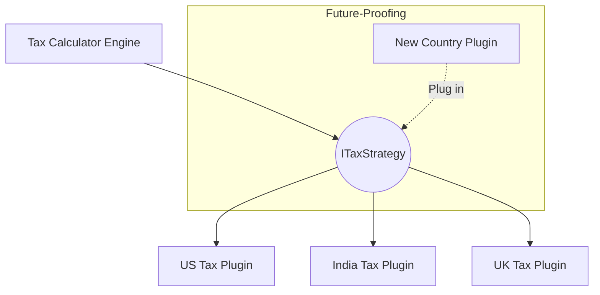

## The Story: The "Chameleon" Calculator

Developer Clara is building a tax calculator for a global company. 

### The Evolution Problem
1. **The Static Hardcoding**: Clara starts by writing tax logic for the USA. Then her boss says, "We need India too." She adds an `if (country == "India")`. Soon she has 50 `if-else` blocks for 50 countries (**The Feature Bloat**).
2. **The Plugin Architecture**: Clara decides to make the system **extensible**. She defines a clear "Tax Strategy" interface. Now, anyone can write a new tax plugin (e.g., `UKTax.py`) and plug it into the calculator without Clara changing a single line of her core code (**Open-Closed Principle**).
3. **The Logical Board**: Clara is building a Chess game. Instead of hardcoding "Pawn moves forward," she creates a "Move Generator" interface. Now, if she wants to add a "Mega-Queen" with new moves, she just adds a new class (**Feature Extensibility**).

Extensible design allows a system to grow and change without requiring a total rewrite of its foundation.

---

## Core Concepts Explained

### 1. Strategy-based Rule Handling
Instead of hardcoding rules, encapsulate each rule in its own class. This allows you to combine rules dynamically at runtime.

### 2. Polymorphism in Business Logic
Use the power of interfaces to handle different business scenarios. The core engine should talk to an abstract `Processor`, and the specific details (Sales Tax, Vat Tax, Income Tax) are handled by concrete implementations.

---

## Extensible Design Visualization



---

## Code Examples: Extensible Payment Rule System

### Python Implementation
```python
from abc import ABC, abstractmethod

class BillingRule(ABC):
    @abstractmethod
    def calculate(self, base_price): pass

class StudentDiscount(BillingRule):
    def calculate(self, base_price): return base_price * 0.8  # 20% off

class VIPBenefit(BillingRule):
    def calculate(self, base_price): return base_price * 0.5  # 50% off

class BillingEngine:
    def __init__(self):
        self.rules = []

    def add_rule(self, rule):
        self.rules.append(rule)

    def calculate_final_price(self, base_price):
        final_price = base_price
        for rule in self.rules:
            final_price = rule.calculate(final_price)
        return final_price

# Execution
engine = BillingEngine()
engine.add_rule(StudentDiscount())
engine.add_rule(VIPBenefit()) # Extensible: Just add more rules
print(f"Final Price: ${engine.calculate_final_price(100)}")
```

### Java Implementation
```java
import java.util.ArrayList;
import java.util.List;

interface ValidationRule {
    boolean isValid(String data);
}

class EmailValidator implements ValidationRule {
    public boolean isValid(String data) { return data.contains("@"); }
}

class LengthValidator implements ValidationRule {
    public boolean isValid(String data) { return data.length() > 5; }
}

public class RegistrationSystem {
    private List<ValidationRule> rules = new ArrayList<>();

    public void addRule(ValidationRule rule) { rules.add(rule); }

    public boolean validate(String input) {
        for (ValidationRule rule : rules) {
            if (!rule.isValid(input)) return false;
        }
        return true;
    }

    public static void main(String[] args) {
        RegistrationSystem system = new RegistrationSystem();
        system.addRule(new EmailValidator());
        system.addRule(new LengthValidator());
        System.out.println("Is valid: " + system.validate("test@me.com"));
    }
}
```

---

## Interview Q&A

### Q1: How does "Interface-based Programming" help in making a system extensible?
**Answer**: It decouples the **Consumer** (the code that uses the logic) from the **Provider** (the implementation). The consumer only knows about the contract (the interface). This allows you to swap out or add new providers at any time without having to change the consumer code.

### Q2: What is the risk of making a system *too* extensible?
**Answer**: (Medium-Hard)
This is known as **Over-engineering**. If you add abstractions for features that will never be built, it makes the code hard to read, debug, and navigate. The goal is to identify "Axes of Change"—parts of the code that are *likely* to change—and make those extensible, while keeping the rest simple.

### Q3: How do you handle "Rule Precedence" in an extensible rule engine?
**Answer**: You can assign a **Priority/Weight** to each rule class. The rule engine can then sort the rules by priority before executing them (e.g., "Always apply Government Tax before applying Store Discounts").
---
