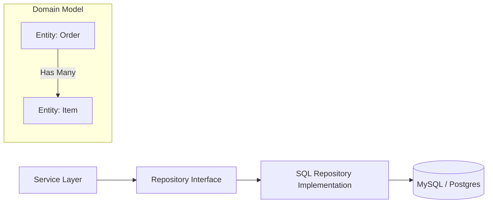

## The Story: The "Messy Office" Cleanup

Manager Mike had an office full of paper files. Every time he needed an "Order," he had to dig through 10 drawers.

### The Management Mess
1. **The Direct Access Chaos**: Mike's coworkers were all reaching into his desk to grab files. Sometimes they'd change a number and forget to tell him. It was impossible to keep the data safe (**Violation of Encapsulation**).
2. **The File Clerk (Repository)**: Mike hired a File Clerk. Now, if anyone wants an Order, they ask the Clerk: `getOrder(id)`. The Clerk knows exactly where the file is and returns it as a neat folder (**Repository Pattern**).
3. **The Relationship Map**: Mike's desk had "Orders" in one drawer and "Customers" in another. The Clerk linked them together: "This Order belongs to Customer #42" (**Relationship Mapping**).
4. **The Safe Transaction**: If Mike writes a new file, the Clerk ensures it's either fully filed away or, if a pen leaks, the messy page is shredded and started over (**Transaction Handling**).

The Persistence layer is the bridge between your clean, object-oriented code and the messy, permanent world of databases.

---

## Core Concepts Explained

### 1. Repository Pattern
Mediates between the domain and data mapping layers. It gives you a "collection-like" interface for accessing domain objects. 
*   **Benefits**: Decouples the business logic from the specific database technology (switching from SQL to Mongo becomes easier).

### 2. Entity Modeling & Mapping
*   **Entity**: An object with a unique identity (like `User[id=101]`). 
*   **Value Object**: An object defined only by its attributes (like `Address[city=NY]`).
*   **ORM (Object-Relational Mapping)**: Tools that automatically map your class fields to database columns.

---

## Persistence Layer Visualization



---

## Code Examples: Repository & Entity Mapping

### Python Implementation (using a Mock DB)
```python
class UserEntity:
    def __init__(self, user_id, name, email):
        self.user_id = user_id
        self.name = name
        self.email = email

class UserRepository:
    def __init__(self):
        # Simulation of a persistent store
        self.storage = {1: UserEntity(1, "Alice", "alice@test.com")}

    def find_by_id(self, user_id):
        print(f"--- [DB Query] SELECT * FROM users WHERE id={user_id} ---")
        return self.storage.get(user_id)

    def save(self, user):
        print(f"--- [DB Save] INSERT INTO users VALUES ({user.user_id}, ...) ---")
        self.storage[user.user_id] = user

# Execution
repo = UserRepository()
user = repo.find_by_id(1)
print(f"User Found: {user.name}")
```

### Java Implementation
```java
import java.util.Optional;

// The Entity
class Product {
    private Long id;
    private String name;
    public Product(Long id, String name) { this.id = id; this.name = name; }
    public String getName() { return name; }
}

// The Repository Interface
interface ProductRepository {
    Optional<Product> findById(Long id);
    void save(Product product);
}

// The Service Layer (Uses Repository)
class ProductService {
    private ProductRepository repo;
    public ProductService(ProductRepository repo) { this.repo = repo; }

    public void renameProduct(Long id, String newName) {
        Product p = repo.findById(id).orElseThrow();
        // Business logic...
        repo.save(new Product(id, newName));
    }
}
```

---

## Interview Q&A

### Q1: What is the difference between "JPA" and "Hibernate" (Java Specific)?
**Answer**: **JPA (Java Persistence API)** is a *specification* (a set of interfaces and rules). **Hibernate** is a *framework* that implements that specification. You can think of JPA as the "Contract" and Hibernate as the "Employee" who fulfills it.

### Q2: What is "Lazy Loading" vs "Eager Loading"?
**Answer**: (Medium-Hard)
*   **Lazy Loading**: The database only fetches related data (like a user's 1000 orders) only when you actually call `user.getOrders()`. This saves memory.
*   **Eager Loading**: The database fetches everything in one giant JOIN query up front. This is faster if you know for sure you will need that data.

### Q3: Why should a Service layer never talk directly to a Database?
**Answer**: It violates the **Dependency Inversion Principle**. If the service talks directly to SQL, you can never change your DB without rewriting the service. By using a Repository, the service only knows "I need a User," and it doesn't care if that user comes from MySQL, an API, or an in-memory test mock.
---
