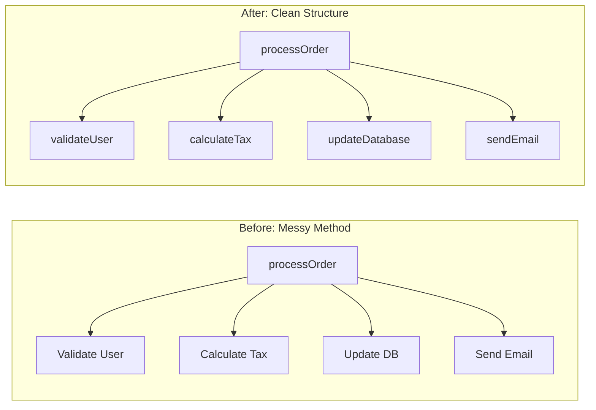

## The Story: The "Spaghetti City" Restoration

Architect Arthur inherited a city map from 50 years ago. The roads were tangled, the names made no sense, and a single pothole could shut down the whole downtown.

### The Cleanup Operation
1. **The Naming Reform**: "Street X" was renamed to "Main Street," and "Building 4B" became "The Library." Now, everyone knows what they are looking at (**Meaningful Naming**).
2. **The "Broken Window" (Code Smells)**: If Arthur sees a messy alleyway, he cleans it immediately. If he doesn't, more trash will accumulate. He looks for "Long Methods" and "God Classes" (**Identifying Code Smells**).
3. **The Logic Split**: The local bakery was also acting as the post office and the jail. Arthur moved the mail to a new building and the jail to the outskirts (**Separation of Concerns**).
4. **The Safe Renovation (Refactoring)**: Arthur changes a road's direction, but he does it at 3 AM and tests it with a few cars first to make sure nobody crashes (**Small, Safe Steps**).

Refactoring is the process of improving the internal structure of code without changing its external behavior. It's how you keep software healthy over time.

---

## Core Concepts Explained

### 1. Code Smells
Indicators that there *might* be a problem in your code.
*   **Long Method**: Methods should do one thing and fit on one screen.
*   **Large Class**: A class trying to handle too many responsibilities (violates SRP).
*   **Data Clumps**: Group of variables that always travel together (e.g., `start_date`, `end_date`) should be their own object.

### 2. Refactoring Techniques
*   **Extract Method**: Taking a chunk of code from a long method and moving it to its own named function.
*   **Rename Variable**: Changing `d` to `days_until_expiry`.
*   **Compose Method**: Organizing a method so it reads like a series of high-level steps.

---

## Refactoring Visualization (Extract Method)



---

## Code Examples: Before & After Refactoring

### Python Implementation
```python
# --- BEFORE ---
def process(u, i):
    if u.is_active:
        if i.price > 0:
            total = i.price * 1.05 # Tax
            print(f"Total for {u.name} is {total}")

# --- AFTER ---
def calculate_taxed_price(price):
    TAX_RATE = 1.05
    return price * TAX_RATE

def is_eligible_for_purchase(user, item):
    return user.is_active and item.price > 0

def process_order(user, item):
    if not is_eligible_for_purchase(user, item):
        return
    
    total = calculate_taxed_price(item.price)
    print(f"Order processed for {user.name}. Total: ${total:.2f}")

# Execution
# process_order() is now readable, testable, and modular.
```

### Java Implementation
```java
// --- BEFORE ---
class Order {
    void handle() {
        // 50 lines of logic for validation, payment, and shipping...
    }
}

// --- AFTER ---
class RefactoredOrder {
    public void process() {
        validate();
        chargePayment();
        arrangeShipping();
    }

    private void validate() { /* logic */ }
    private void chargePayment() { /* logic */ }
    private void arrangeShipping() { /* logic */ }
}
```

---

## Interview Q&A

### Q1: What is a "Code Review" and why is it important?
**Answer**: A Code Review is a process where developers check each other's code before it's merged into the main repository. It helps catch bugs, ensure consistent style, share knowledge across the team, and improve the overall design of the system.

### Q2: What is "Technical Debt"?
**Answer**: (Medium-Hard)
It's a metaphor for the long-term cost of choosing an easy, messy solution now instead of a better, cleaner one that takes longer. Like financial debt, it accrues "interest"—as the codebase grows, the messy parts make it harder and slower to add new features until you eventually pay it back through refactoring.

### Q3: When should you NOT refactor?
**Answer**: 
1. **No Tests**: If you don't have unit tests, refactoring is dangerous because you won't know if you broke the external behavior.
2. **Close to Deadline**: If you are hours away from a major release, refactoring can introduce last-minute risks.
3. **Rewrite is better**: If the code is so "rotten" that fixing it takes longer than building it from scratch.
---
