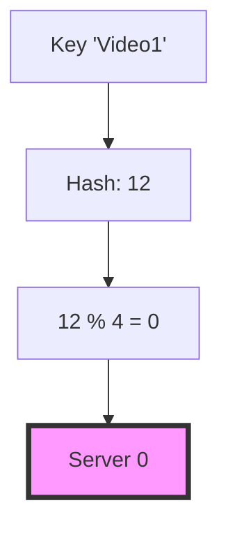
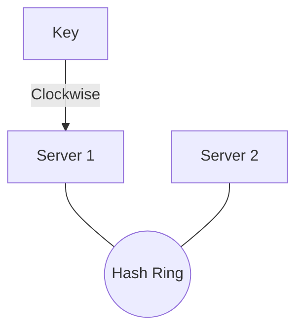

## The Story: The "Cache Inconsistency" at StreamIt

StreamIt, a global video streaming platform, used multiple Redis servers to cache video metadata. When the system was scaled-up from 4 to 5 servers, almost 80% of the cache entries were invalidated because the simple modulo-based hashing (`hash(key) % N`) shifted all the mappings. This caused a massive DDOS on the backend database. To solve this, StreamIt must implement **Consistent Hashing**.

---

## 1. Why Standard Hashing Fails

### The Problem with `hash(key) % N`
If you have `N` servers, adding or removing a server (changing `N`) causes nearly every key to remap to a different server.



*When scaled to 5 servers:* `12 % 5 = 2`. The request now goes to Server 2 instead of Server 0 (Cache Miss!).

---

## 2. The Consistent Hashing Solution

Imagine a hash ring (Range 0 to 2^32 - 1). Servers and keys are both mapped onto this ring.

1.  **Map Servers**: Use `hash(server_ip)` to place servers on the ring.
2.  **Map Keys**: Use `hash(key)` to place keys on the ring.
3.  **Find Server**: To find a server for a key, go clockwise until you hit the first server.



*If a server is added or removed*, only a small fraction of keys (`1/N`) are remapped.

---

## 3. High Depth: Virtual Nodes

A major issue with consistent hashing is **Data Skew**. Some servers may handle far more keys than others. We solve this with **Virtual Nodes**.

*   Each physical server is represented by multiple virtual nodes (e.g., Server1-V1, Server1-V2).
*   The more virtual nodes a server has, the more uniform the distribution becomes.

---

## 4. Deep Dive: Java Implementation

This implementation uses `TreeMap` to simulate the hash ring and `MD5` to ensure high entropy.

```java
import java.util.*;
import java.security.MessageDigest;
import java.security.NoSuchAlgorithmException;

/**
 * Consistent Hashing Implementation with Virtual Nodes
 */
public class ConsistentHashRouter {
    private final SortedMap<Long, String> ring = new TreeMap<>();
    private final int virtualNodeCount;

    public ConsistentHashRouter(int virtualNodeCount, List<String> nodes) {
        this.virtualNodeCount = virtualNodeCount;
        for (String node : nodes) {
            addNode(node);
        }
    }

    public void addNode(String node) {
        for (int i = 0; i < virtualNodeCount; i++) {
            long hash = getHash(node + "-v" + i);
            ring.put(hash, node);
        }
    }

    public void removeNode(String node) {
        for (int i = 0; i < virtualNodeCount; i++) {
            long hash = getHash(node + "-v" + i);
            ring.remove(hash);
        }
    }

    public String getNode(String key) {
        if (ring.isEmpty()) return null;
        
        long hash = getHash(key);
        // Find the first virtual node with a hash >= request hash
        SortedMap<Long, String> tailMap = ring.tailMap(hash);
        
        // If the tail map is empty, wrap around to the first node
        long nodeHash = tailMap.isEmpty() ? ring.firstKey() : tailMap.firstKey();
        return ring.get(nodeHash);
    }

    /**
     * Using MD5 for balanced distribution across the 64-bit space
     */
    private long getHash(String key) {
        try {
            MessageDigest md = MessageDigest.getInstance("MD5");
            byte[] bytes = md.digest(key.getBytes());
            // Use only the first 8 bytes for simplicity (64-bit long)
            long res = 0;
            for (int i = 0; i < 8; i++) {
                res <<= 8;
                res |= (bytes[i] & 0xFF);
            }
            return Math.abs(res);
        } catch (NoSuchAlgorithmException e) {
            return key.hashCode();
        }
    }

    public static void main(String[] args) {
        List<String> servers = Arrays.asList("192.168.0.1", "192.168.0.2", "192.168.0.3");
        ConsistentHashRouter router = new ConsistentHashRouter(100, servers);

        System.out.println("Routing simulation:");
        String key = "User-001-Meta";
        System.out.println("Key '" + key + "' routed to: " + router.getNode(key));
        
        System.out.println("\nAdding a new server...");
        router.addNode("192.168.0.4");
        System.out.println("Key '" + key + "' now routed to: " + router.getNode(key));
    }
}
```

---

## Interview Q&A

### Q1: What is the main advantage of Consistent Hashing over normal hashing?
**Answer**: Minimal remapping. When a server is added or removed, only `1/N` keys are moved. In normal hashing, almost 99% of keys shift, causing cache thundering herds.

### Q2: How do you choose the number of Virtual Nodes?
**Answer**: There is a trade-off. More virtual nodes lead to better balance (less data skew) but increase the memory used by the hash ring and the time to look up a node. A common starting point is 100-200 virtual nodes per physical server.

### Q3: How do you handle servers with different capacities?
**Answer**: You can assign a higher `virtualNodeCount` to more powerful servers. This maps them to more segments of the hash ring, naturally attracting more traffic.
