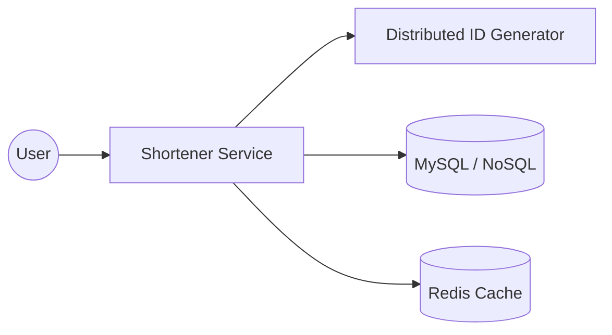

## The Story: The "TinyLink" Startup

Jack is building **TinyLink**, a service to shorten long URLs for social media. He needs to handle billions of URLs while ensuring fast redirects and high availability. If the system fails, millions of shared links will break!

---

## 1. Understand the Problem and Scope

### Key Requirements:
*   **Shortening**: Convert `https://very-long-url.com/some/path` to `https://t.ly/abc123`.
*   **Redirection**: Clicking the short link redirects to the long link (301 vs 302).
*   **Scale**: 100 million new URLs per day.
*   **Availability**: 99.9% (link redirection is critical).

### Redirection Types (Interview Tip):
*   **301 Permanent Redirect**: Browser caches the mapping. Better for server load.
*   **302 Temporary Redirect**: Browser always asks the server. Better for analytics (tracking every click).

---

## 2. Approach Options

### A. Hash Functions (MD5 / SHA-1)
Map a long URL to a hash and take the first few characters.
*   **Cons**: Hash collisions. You must append a string and re-hash until unique.

### B. Base62 Encoding (Recommended)
Convert a unique number (from a Distributed ID Generator) to a Base62 string (`0-9`, `a-z`, `A-Z`).

---

## 3. Design Deep Dive: Base62 & Redirection

### Base62 Logic:
If our ID is `1,000,000,000`, how many characters do we need?
*   62^7 ≈ 3.52 Trillion. 7 characters is plenty for our scale.



---

## 4. Java Implementation: Base62 Converter

This code converts a unique ID (Long) into a 7-character string.

```java
import java.util.HashMap;
import java.util.Map;

/**
 * URL Shortener Logic: Base62 Encoding
 */
public class UrlShortener {
    private static final String BASE62 = "0123456789abcdefghijklmnopqrstuvwxyzABCDEFGHIJKLMNOPQRSTUVWXYZ";
    private static final int BASE = BASE62.length();
    
    // In-memory mock database for long URL storage
    private static final Map<Long, String> urlStore = new HashMap<>();

    /**
     * Encodes a long ID into a Base62 string
     */
    public String encode(long id) {
        StringBuilder sb = new StringBuilder();
        while (id > 0) {
            sb.append(BASE62.charAt((int) (id % BASE)));
            id /= BASE;
        }
        // Reverse to maintain most significant bit order
        return sb.reverse().toString();
    }

    /**
     * Decodes a Base62 string back into a long ID
     */
    public long decode(String shortUrl) {
        long id = 0;
        for (int i = 0; i < shortUrl.length(); i++) {
            id = id * BASE + BASE62.indexOf(shortUrl.charAt(i));
        }
        return id;
    }

    public void saveUrl(long id, String longUrl) {
        urlStore.put(id, longUrl);
    }

    public String getLongUrl(String shortUrl) {
        long id = decode(shortUrl);
        return urlStore.get(id);
    }

    public static void main(String[] args) {
        UrlShortener shortener = new UrlShortener();
        long uniqueId = 1234567890L; // From Snowflake Generator
        String longUrl = "https://www.youtube.com/watch?v=dQw4w9WgXcQ";
        
        String shortCode = shortener.encode(uniqueId);
        shortener.saveUrl(uniqueId, longUrl);
        
        System.out.println("Long URL: " + longUrl);
        System.out.println("Short Code: " + shortCode);
        System.out.println("Resolved URL: " + shortener.getLongUrl(shortCode));
    }
}
```

---

## Interview Q&A

### Q1: How do you handle redirection for a high-traffic link (The "Viral Link" problem)?
**Answer**: Use aggressive **Caching (Redis)**. For a viral link, 99.9% of requests will hit the cache, sparing the database. We can also use a CDN to handle the redirect at the edge.

### Q2: What's the benefit of a 301 vs 302 redirect in a URL shortener?
**Answer**: 
*   **301**: Reduces server load as the browser remembers the link. However, you lose analytics (you only see the first click).
*   **302**: You track every click for analytics, which is how Bitly and TinyURL charge for their services.

### Q3: How do you handle "Expiration" of links?
**Answer**: Add an `expired_at` column in the database. A cleanup job (batch process) can periodically delete expired links to free up storage.
