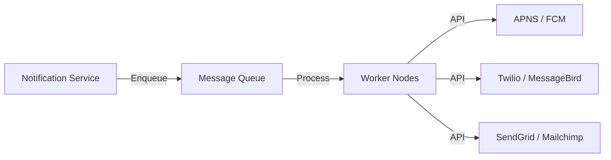

## The Story: The "Engagement Engine" at SocialBuddy

Nico is building **SocialBuddy**, a new social network. To keep users engaged, he needs a redundant and scalable **Notification System** that can send millions of SMS, Push Notifications, and Emails every hour. If notifications are delayed or lost, users will miss important updates!

---

## 1. Understand the Problem and Scope

### Key Requirements:
*   **Channels**: Push (iOS/Android), SMS, Email.
*   **Real-time?**: As close to real-time as possible.
*   **Scale**: 10 million notifications per day.
*   **Reliability**: No notifications should be lost.
*   **Deduplication**: Don't send the same notification twice.

---

## 2. High-Level Design

The system needs to be decoupled to handle different speeds of providers (e.g., Email is slower than Push).

1.  **Notification Service**: Receives payload from apps.
2.  **Message Queue**: Buffers requests (Kafka/RabbitMQ).
3.  **Workers**: Pull from queue and call 3rd-party providers (SendGrid, Twilio, APNS/FCM).



---

## 3. Design Deep Dive: Reliability & Rate Limiting

### A. Reliability (No Data Loss)
*   **Messaging Queue Persistence**: Ensure messages are stored even if a worker crashes.
*   **Retry Mechanism**: Exponential backoff if a provider returns a 5xx error.

### B. Rate Limiting (Politeness & Spam Control)
*   Limit the number of notifications sent to a single user in a 1-hour window to prevent spam.

---

## 4. Java Implementation: Notification Delivery Logic

This Java code shows how a worker might process a notification with a simple retry strategy.

```java
import java.util.*;

/**
 * Simplified Notification Worker with Retry Logic
 */
public class NotificationWorker {
    private final int MAX_RETRIES = 3;

    public void processNotification(String userId, String message, String channel) {
        boolean success = false;
        int attempts = 0;

        while (attempts < MAX_RETRIES && !success) {
            attempts++;
            System.out.println("Attempting " + channel + " for " + userId + " (Attempt " + attempts + ")");
            
            success = mockCallProvider(channel, message);
            
            if (!success) {
                System.out.println("Wait and Retry for " + userId + "...");
                try { Thread.sleep(500 * attempts); } catch (InterruptedException e) {}
            }
        }

        if (success) {
            System.out.println("Notification sent to " + userId + " successfully.");
        } else {
            System.err.println("FAILED to send notification to " + userId + " after " + MAX_RETRIES + " attempts.");
        }
    }

    private boolean mockCallProvider(String channel, String message) {
        // Simulating a provider failure 50% of the time for the first attempt
        return new Random().nextBoolean();
    }

    public static void main(String[] args) {
        NotificationWorker worker = new NotificationWorker();
        worker.processNotification("user_789", "Your package is arriving!", "PUSH");
    }
}
```

---

## Interview Q&A

### Q1: How do you handle "Notification Fatigue" (too many notifications)?
**Answer**: Implement a **Frequency Capping** service. Check a user's notification history (stored in Redis) before sending. If they've received more than `X` notifications in `Y` time, skip the non-urgent ones.

### Q2: Why use Message Queues in a notification system?
**Answer**: 
1.  **Decoupling**: The main app doesn't wait for the slow Email provider.
2.  **Buffering**: Handles sudden spikes in traffic (e.g., a "Breaking News" alert).
3.  **Reliability**: If a worker node crashes, the message remains in the queue for another worker to pick up.

### Q3: How do you ensure "At-Least-Once" delivery?
**Answer**: Use the **Acknowledge (ACK)** feature of message queues. A message is only removed from the queue *after* the worker successfully calls the provider and sends an ACK back to the queue.
