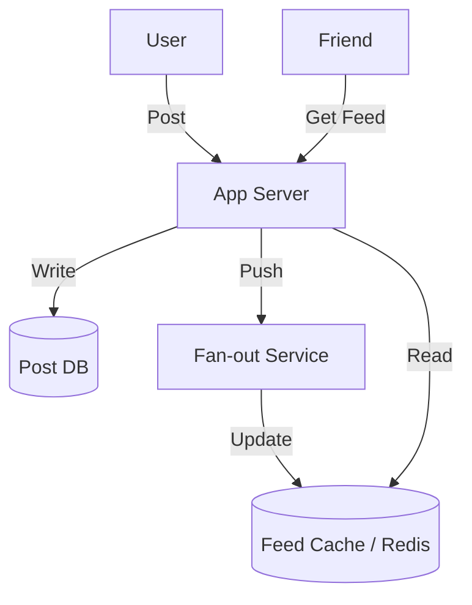

## The Story: The "FeedFlow" Challenges

Zoe is a backend engineer at **FeedFlow**, a fast-growing social network. As the user base grows, she faces a major problem: "How to generate a customized news feed for millions of users in real-time?" Should we push updates to everyone when a celebrity posts, or should we pull the data when a user opens the app?

---

## 1. Understand the Problem and Scope

### Key Requirements:
*   **Feed Publishing**: When a user posts, it should appear in their friends' feeds.
*   **Feed Building**: Aggregating posts from all followed users in reverse chronological order.
*   **Scale**: 10 million DAU.
*   **Latency**: Feed generation must be < 200ms.

---

## 2. High-Level Design: Two Main Flows

### A. Feed Publishing Flow
1.  **Post API**: User submits a post.
2.  **Notification**: Push the post to the fan-out service.
3.  **Fan-out Service**: Push post to friends' feed caches.

### B. Feed Building Flow
1.  **Feed API**: User requests their feed.
2.  **Cache Hit**: Retrieve from the pre-generated feed cache (Redis).



---

## 3. Design Deep Dive: Fan-out Strategies

### Option 1: Fan-out on Write (Push Model)
*   **How it works**: Pre-generate the feed when a user posts.
*   **Pros**: Fast read. `O(1)` fetch from cache.
*   **Cons**: The "Celebrity Problem." If a user has 10M followers, one post triggers 10M writes!

### Option 2: Fan-out on Load (Pull Model)
*   **How it works**: Generate the feed only when a user requests it.
*   **Pros**: Efficient for posters. No celebrity problem.
*   **Cons**: Slow read. Aggregating 500+ users' posts on the fly is expensive.

---

## 4. Java Implementation: The Hybrid Fan-out Pattern

A common industry standard is a **Hybrid Model**: 
*   Use Push for regular users.
*   Use Pull for celebrities (to avoid write storms).

```java
import java.util.*;

/**
 * Simplified Hybrid Fan-out Logic in Java
 */
public class NewsFeedService {
    // Mock user follow counts
    private final Map<String, Integer> followerCount = new HashMap<>();

    public NewsFeedService() {
        followerCount.put("user_normal", 50);
        followerCount.put("celeb_123", 5_000_000);
    }

    public void processNewPost(String userId, String postId) {
        int count = followerCount.getOrDefault(userId, 0);

        if (count > 100_000) {
            System.out.println("Processing CELEBRITY post [" + postId + "]: Skip Push. Use Pull for followers.");
            // Logic: Just save to Celeb's Post List in DB.
        } else {
            System.out.println("Processing NORMAL post [" + postId + "]: Pushing to " + count + " followers' feed caches.");
            // Logic: Iterate through follower IDs and update their Redis feed cache.
            pushToFollowers(userId, postId);
        }
    }

    private void pushToFollowers(String userId, String postId) {
        // Mocking the write to Redis for each follower
        System.out.println("--- Fan-out on Write completed for " + userId + " ---");
    }

    public static void main(String[] args) {
        NewsFeedService service = new NewsFeedService();
        service.processNewPost("user_normal", "post_1");
        service.processNewPost("celeb_123", "post_king");
    }
}
```

---

## Interview Q&A

### Q1: How do you handle the "Celebrity Problem" (Hot Key in Redis)?
**Answer**: Use the **Hybrid Model**. Don't push a celebrity's post to all millions of followers' caches. Instead, let followers pull celebrity posts and merge them with their pre-cached feed at read-time.

### Q2: Why is Redis preferred over MySQL for the news feed?
**Answer**: Speed. News feeds are extremely read-heavy. Fetching from an in-memory sorted set in Redis is nanoseconds, whereas a SQL `JOIN` across multiple large tables (following + posts) can take several seconds at scale.

### Q3: How do you ensure the feed is always "Fresh"?
**Answer**: (Medium-Hard) 
Use a **Limit + TTL** strategy in Redis. Only store the latest 100-200 posts per user. If a user scrolls deeper, they trigger a "Cold Pull" from the main database. This ensures the 99% of active users get high-speed access to the newest data.
