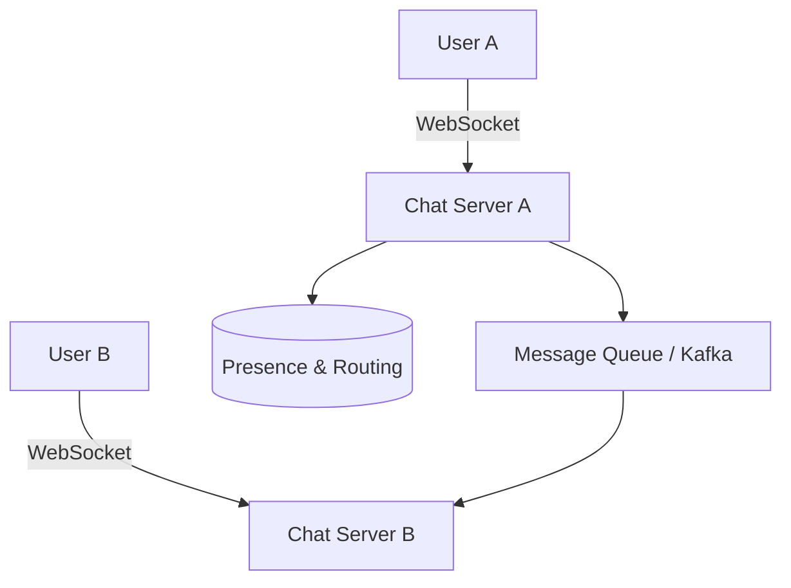

## The Story: The "LiveChat" Scaling Crisis

The team at **LiveChat** is building an enterprise messaging app like Slack. Their MVP crashed as soon as 1,000 users joined a single channel. They need a system that supports 1v1 chat, group chat, and "Online/Offline" presence status for millions of users.

---

## 1. Understand the Problem and Scope

### Key Requirements:
*   **1v1 Chat**: Low latency.
*   **Group Chat**: Up to 500 members.
*   **Presence**: Real-time "Online" status.
*   **Media**: Support images/videos (handled by S3/CDN).
*   **Scale**: 1 million DAU.

---

## 2. Communication Protocols

How does the server "push" a message to a client?
1.  **Polling**: Client asks every 1s. **Bad**: Too many empty requests.
2.  **Long Polling**: Server holds the request open until a message arrives. **Better** but still inefficient.
3.  **WebSocket (Recommended)**: Bi-directional, persistent connection. Low overhead after the initial handshake.



---

## 3. Design Deep Dive: Presence Service

How do we know if a friend is online?
*   **Heartbeats**: The client sends a "heartbeat" every 5 seconds to a Presence Server.
*   **Redis Storage**: High-speed storage to keep track of `{user_id: timestamp}`.
*   **Status Update**: If no heartbeat is received for 30 seconds, the user is marked "Offline."

---

## 4. Java Implementation: Simple WebSocket-style Handler

This code demonstrates how a Chat Server handles an incoming message and routes it to the correct user using a mock "Session Manager."

```java
import java.util.*;
import java.util.concurrent.ConcurrentHashMap;

/**
 * Simplified Chat Server Logic in Java
 */
public class ChatServerHandler {
    // Map of UserId -> Active WebSocket Connection
    private final Map<String, String> sessionMap = new ConcurrentHashMap<>();
    
    public void onConnect(String userId, String sessionId) {
        sessionMap.put(userId, sessionId);
        System.out.println("User [" + userId + "] connected on session " + sessionId);
        updatePresence(userId, true);
    }

    public void onMessage(String senderId, String receiverId, String content) {
        System.out.println("Processing: " + senderId + " -> " + receiverId + ": " + content);
        
        if (sessionMap.containsKey(receiverId)) {
            deliverMessage(receiverId, content);
        } else {
            System.out.println("User " + receiverId + " is offline. Saving to Push Notification Queue.");
            // Logic: Push to Session 30 (Notification System)
        }
    }

    private void updatePresence(String userId, boolean isOnline) {
        System.out.println("Presence Update: User " + userId + " is now " + (isOnline ? "ONLINE" : "OFFLINE"));
    }

    private void deliverMessage(String userId, String message) {
        String sessionId = sessionMap.get(userId);
        System.out.println("--- Pushing message to Session [" + sessionId + "] ---");
    }

    public static void main(String[] args) {
        ChatServerHandler chatSrv = new ChatServerHandler();
        
        // Simulating two users
        chatSrv.onConnect("Alice", "CONN_001");
        chatSrv.onMessage("Bob", "Alice", "Hello Alice!");
        chatSrv.onMessage("Alice", "Bob", "Hi Bob! You look offline to me.");
    }
}
```

---

## Interview Q&A

### Q1: Why use WebSockets instead of HTTP for chat?
**Answer**: HTTP is unidirectional—the server cannot initiate a message. WebSockets provide a persistent, two-way pipe. After the initial handshake (Layer 7), communication is extremely fast and has very low header overhead compared to HTTP.

### Q2: How do you handle group chats with 100,000 members?
**Answer**: (Hard) You don't use standard message delivery. For massive groups, you use a **Fan-out on Load (Pull)** model. When a message is sent, you store it in a central database. Members only pull new messages when they open the chat window.

### Q3: How do you ensure messages are delivered in the correct order?
**Answer**: (Medium-Hard) 
1.  **Sequence Numbers**: Assign a monotonically increasing sequence ID per conversation (not per server, as servers have clock drift).
2.  **Database Ordering**: Use a `created_at` timestamp with millisecond precision, but augment it with a local counter to handle messages sent in the exact same millisecond.
